# Absolute Zero 아키텍처 진화 설계서

> 문서 성격: 현재 구조 분석 + MiniSurvival 패턴 적용성 평가 + 목표 구조 + 단계적 전환 계획  
> 작성 기준일: 2026-08-18 / 실행 계획 재검토: 2026-08-19  
> 대상 Unity: 6000.3.11f1  
> 비교 자료: `C:\Users\paek6\OneDrive\Desktop\MiniSurvival\PROJECT_SYSTEM_DESIGN.md`  
> 중요: 이 문서는 목표 구조를 확정하기 위한 설계 산출물이다. 아직 대규모 런타임 리팩터링을 적용했다는 의미는 아니다.
> 구현 순서와 단계별 완료 조건의 기준 문서는 `Docs/Plans/PLAN_018_architecture_migration.md`다.

---

## 1. 결론부터 보기

MiniSurvival의 코드를 그대로 복사하는 것은 적절하지 않다. MiniSurvival은 단일 플레이 학습 프로젝트이고 Absolute Zero는 NGO 기반 1대1 네트워크 게임이므로, 객체 수명과 권한 모델이 다르다.

가장 가치 있는 부분은 개별 구현보다 다음 설계 원칙이다.

1. 구체 구현 대신 경계 인터페이스에 의존한다.
2. 시작 순서를 하나의 초기화 파이프라인에서 관리한다.
3. 비동기 작업에 명확한 수명과 취소 토큰을 연결한다.
4. 빈번하게 생성·삭제되는 객체는 풀링한다.
5. 도메인 결과와 화면 표현을 이벤트 계약으로 분리한다.
6. 모듈 의존 방향을 어셈블리 단위로 제한한다.

Absolute Zero에는 이 원칙을 다음과 같이 적용하는 것이 가장 안전하다.

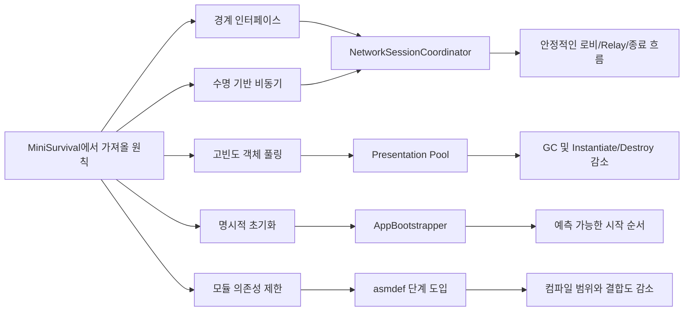

### 최종 권고

| 항목 | 결정 | 이유 |
|---|---|---|
| 인터페이스 | 적극 적용 | 외부 서비스, 네트워크 런타임, 씬 전환, 플레이어 조회처럼 변경 가능성이 큰 경계에 효과적 |
| Composition Root | 적극 적용 | 현재 19개 Singleton과 다수의 `Find*` 호출을 한곳에서 연결 가능 |
| Unity `Awaitable` | 선택 적용 | Unity 프레임·시간·수명 작업에 적합하지만 SDK I/O의 `Task`까지 억지로 바꾸면 오히려 복잡해짐 |
| `Task` | 유지 | Unity Services, Lobby, Relay처럼 원래 `Task`를 반환하는 I/O 경계와 병렬 조합에 적합 |
| Coroutine | 유지 후 점진 전환 | VFX, 애니메이션, 중단 가능한 프레임 시퀀스는 현재도 자연스럽고 전면 교체 이익이 작음 |
| SO EventChannel | 개념만 선택 적용 | 네트워크 권위 상태에는 부적합. 로컬 UI/VFX 알림에는 유용하지만 현재 런타임 UI 정책과 Inspector 자산 증가를 고려해야 함 |
| Static EventBus | 적용하지 않음 | 전역 상태, 구독 누수, 테스트 격리 문제가 현재 Singleton 문제를 반복함 |
| Object Pool | 적극 적용 | 아이템 월드 뷰, 전투 파티클, 이모트 버블처럼 반복 생성되는 표현 객체에 효과적 |
| Addressables | 후순위 선택 적용 | 리소스 규모가 커질 때 유효하지만 NGO NetworkPrefab과 핵심 씬 자산을 즉시 옮기는 것은 위험함 |
| Job System | 현재 적용하지 않음 | 2인 턴제 로직에는 데이터 규모가 작아 스케줄링 비용과 복잡성이 이익보다 큼 |
| asmdef | 안정화 후 적용 | 의존 경계를 강제하고 컴파일 범위를 줄이지만 현재 순환 참조를 먼저 해소해야 함 |

---

## 2. 분석 근거와 현재 지표

### 2.1 프로젝트 현재 상태

| 지표 | 현재 값 | 의미 |
|---|---:|---|
| C# 파일 | 72 | Core 49, UI 21, Test 2 |
| 아이템 SO | 21 | 기본 4, 랜덤 17 |
| 사용자 코드 asmdef | 0 | 전부 사실상 `Assembly-CSharp`에 결합 |
| Singleton 보유 파일 | 19 | 전역 접근과 수명 경계가 넓음 |
| `GameObject.Find` | 15회 | 문자열 기반 씬 조회 |
| `FindObjectsByType` | 8회 | 플레이어/엔티티 재탐색 |
| `FindAnyObjectByType` | 7회 | 관리자 런타임 탐색 |
| `Resources.Load<T>` | 30회 | 문자열 기반 개별 리소스 조회 |
| `Resources.LoadAll<T>` | 8회 | 런타임 스프라이트 묶음 조회 |
| `Instantiate` | 6개 호출 지점 | 생성 지점 자체는 적지만 런타임 빌더 내부 반복 생성량이 큼 |
| `Destroy(...)` | 36개 실제 호출 지점 | UI/VFX/월드 뷰 재생성 비용 후보 |
| `OnDestroy()` | 17개 생명주기 콜백 선언 | 구독 해제와 수명 cleanup 검증 지점이며 `Destroy` 호출 수에는 포함하지 않음 |
| `StartCoroutine` | 60개 호출 지점 | 턴·VFX·UI 시간이 Coroutine에 분산 |
| async 메서드 선언 | 30개 | 5개 파일, 테스트 UI 포함. `async` 키워드는 11개 람다를 포함해 총 41회이며 현재 `Awaitable` 사용 없음 |

호출 횟수는 무조건적인 문제 점수가 아니다. 중요한 것은 호출 시점과 반복 빈도다. 초기화 중 한 번 호출되는 `Find`보다 매 턴 전체 재생성되는 뷰나 중첩 가능한 `async void` 폴링이 우선 개선 대상이다.

### 2.2 책임이 집중된 주요 클래스

| 파일 | 줄 수 | 현재 책임 |
|---|---:|---|
| `AZGameUI.cs` | 1,310 | UI 생성, 바인딩, 입력, 온도 표시, 환경 표시, 오디오 연결, 월드 UI |
| `CombatVFXManager.cs` | 760 | 결과 해석, 아이템별 분기, 애니메이션, SFX, 파티클, 온도 표시 보정 |
| `TurnManager.cs` | 721 | 플레이어 탐색, 턴 상태, 환경 효과, 전투 호출, 라운드 리셋, RPC |
| `InventoryPresenter.cs` | 694 | 플레이어 탐색, 구독, 뷰 생성/삭제, 입력, 선택, 재빌드 잠금 |
| `EnvironmentVFXManager.cs` | 645 | 리소스 로드, 오브젝트 생성, 환경별 연출, 코루틴 |
| `LobbyManager.cs` | 561 | Unity Services 초기화, 인증, Lobby CRUD, 상태, heartbeat, polling |
| `PlayerSpawnManager.cs` | 323 | 콜백 등록, 대기 큐, 플레이어 생성/삭제, SpawnPoint 탐색 |

이 구조는 프로토타입을 빠르게 완성하는 데는 유리했지만, 기능 추가 시 한 클래스가 변경되는 이유가 너무 많아지는 단계에 도달했다.

---

## 3. MiniSurvival에서 실제로 확인된 설계 요소

### 3.1 좋은 적용 사례

| 사례 | 핵심 | Absolute Zero 적용 |
|---|---|---|
| `IDamageable` | 공격자가 구체적인 Enemy를 몰라도 피해 계약만 호출 | 아이템 실행기가 구체 PlayerState보다 온도·인벤토리 변경 계약을 보도록 일부 적용 가능 |
| `IObjectPool<EnemyHealth>` | 객체가 구체 풀 구현을 몰라도 반환 가능 | VFX, 이모트, 아이템 뷰 풀에 직접 적용 가능 |
| `WaveManagerAwaitable` | 로드 → 검증 → 풀 생성 → 실행을 한 비동기 파이프라인으로 구성 | Unity Services 초기화와 네트워크 세션 생성 흐름에 적용 가능 |
| `destroyCancellationToken` | MonoBehaviour 파괴 시 대기 작업 취소 | 로딩 화면, 로컬 연출, 씬 종속 비동기에 적용 가능 |
| EventChannel | 발행자와 UI 리스너 분리 | 로컬 표현 이벤트에만 선택 적용 가능 |
| asmdef | Core를 UI와 Gameplay가 의존하고 역방향 의존을 방지 | Domain/Foundation과 Presentation/Networking 분리에 적용 가능 |
| Pool prewarm | 첫 사용 순간의 Instantiate 몰림 방지 | 전투 VFX와 반복 UI 오브젝트에 적용 가능 |

### 3.2 그대로 가져오면 안 되는 부분

| MiniSurvival 방식 | Absolute Zero에서의 문제 | 대안 |
|---|---|---|
| 전역 Static EventBus | 씬 전환 후 구독 잔존, 테스트 격리 곤란 | 수명 범위가 있는 `ILocalEventHub` 인스턴스 |
| SO EventChannel로 모든 상태 전달 | 네트워크 상태의 권위와 재접속 snapshot을 보장하지 못함 | 공유 상태는 NetworkVariable/NetworkList, 로컬 파생 알림만 EventHub |
| 모든 시간을 Awaitable로 전환 | VFX 중간 중단과 현재 코루틴 자산을 한 번에 깨뜨림 | Unity I/O·수명 작업부터 점진 적용 |
| Addressables로 핵심 Player prefab 로드 | NGO prefab 등록과 GUID/씬 직렬화 위험 | NetworkPrefab은 현재 유지, 비네트워크 표현 자산부터 검토 |
| Job System 도입 | 2인용 턴 계산은 작업량이 너무 작음 | 순수 C# 로직과 할당 감소를 먼저 수행 |
| 인터페이스를 모든 클래스에 추가 | 추상화만 늘고 실제 교체 지점이 없음 | 외부 경계, 시간·랜덤, 조회, 표현 계약에만 사용 |

---

## 4. 현재 전체 관리 구조

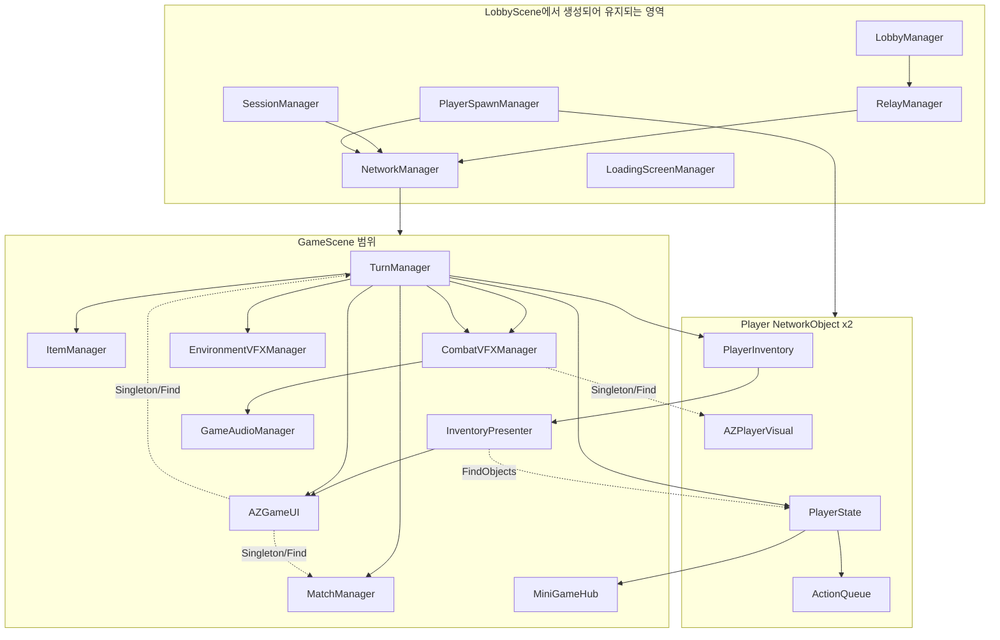

### 현재 관리 방식의 특징

- 각 Manager가 자신의 Singleton 수명, 초기화, 조회, 이벤트 구독을 스스로 처리한다.
- UI가 여러 Manager를 직접 찾아 호출한다.
- GameScene 시스템들이 서로의 `Instance`를 통해 횡단 접근한다.
- `TurnManager`가 서버 도메인 흐름과 클라이언트 표현 대기까지 함께 제어한다.
- 플레이어의 논리 인덱스, NGO ClientId, OwnerClientId가 여러 위치에서 변환된다.
- 씬 이름, 오브젝트 이름, Resources 경로가 문자열로 분산되어 있다.

---

## 5. 현재 기능별 흐름

### 5.1 앱 시작과 서비스 초기화

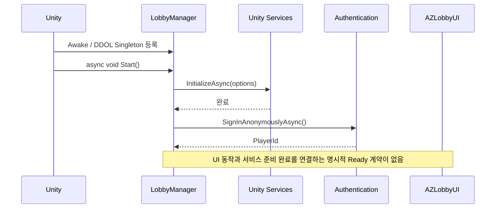

현재 위험:

- `Start()`가 `async void`여서 외부에서 초기화 완료를 기다릴 수 없다.
- 초기화 실패가 이벤트와 로그로만 전달되고 상태 머신으로 표현되지 않는다.
- UI 입력이 초기화보다 먼저 들어오면 서비스 호출 실패 가능성이 있다.

### 5.2 Host 생성과 게임 시작

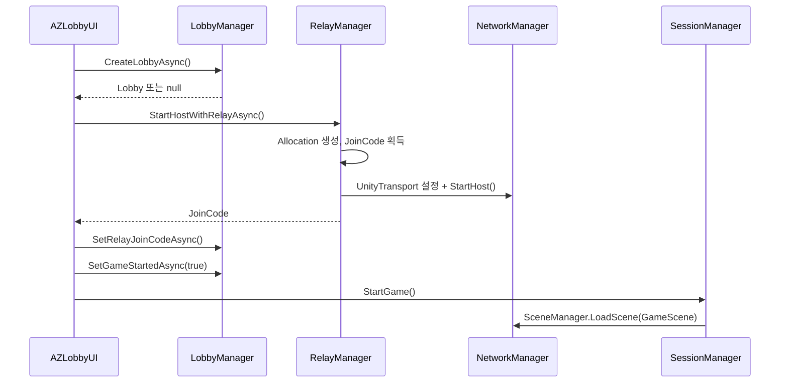

현재 특징:

- UI가 Lobby, Relay, Session 세 Manager의 오케스트레이터 역할을 한다.
- 중간 단계 실패 시 이전 단계 보상 작업이 한곳에 모여 있지 않다.
- 버튼 연타에 대한 세션 단위 직렬화가 없다.

### 5.3 Client 참가

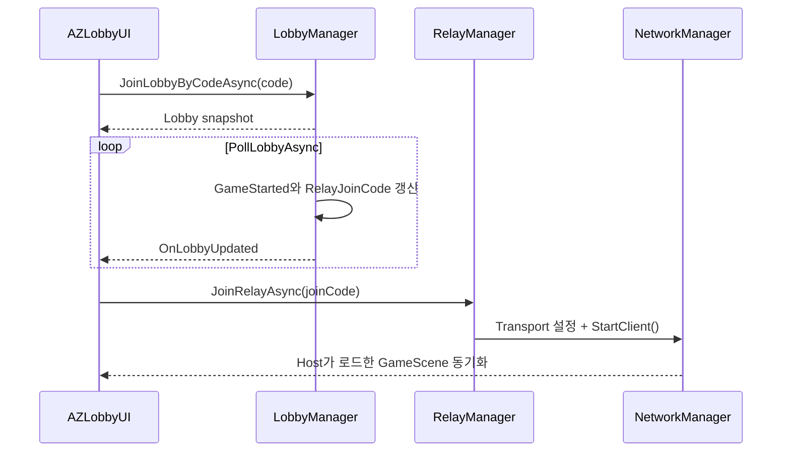

현재 위험:

- `PollLobbyAsync()`가 `async void`이고 이전 요청 완료 전에 다음 요청이 시작될 가능성이 있다.
- `currentLobby`가 대기 중 사라질 때 `currentLobby.Id` 접근 경쟁 가능성이 있다.
- 참가 성공, Relay 연결, 씬 전환을 하나의 세션 상태로 추적하지 않는다.

### 5.4 씬 로드와 플레이어 생성

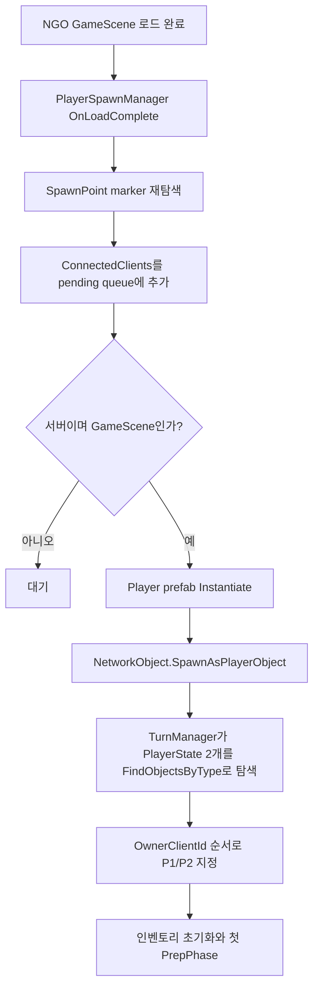

현재 위험:

- ClientId 모듈러 연산으로 SpawnPoint를 정하는 경로와 논리 PlayerIndex 지정 경로가 분리되어 있다.
- TurnManager가 플레이어가 생길 때까지 전체 씬 검색을 반복한다.
- late join, 재접속, client ID가 0/1이 아닌 경우를 별도 계약으로 표현하지 않는다.

### 5.5 PrepPhase

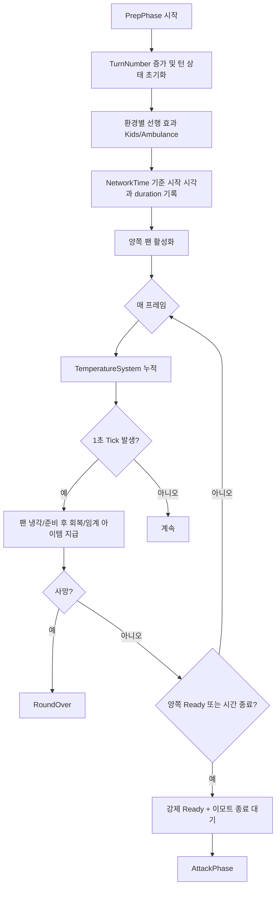

### 5.6 아이템 선택과 미니게임

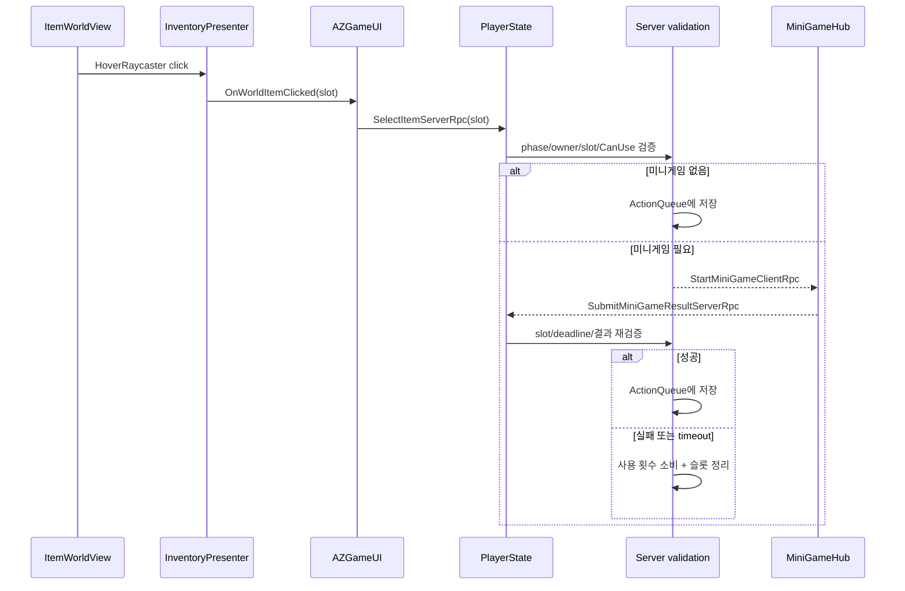

현재 `PlayerState.BuildContext()`는 `TurnManager.Instance`에서 단일 opponent와 modifiers/temperature/buff/drop table을 직접 조립한다. Phase 1C에서는 opponent lookup만 Registry로 바꾸고, 나머지 singleton service 접근은 Phase 5에서 Match composition이 제공하는 명시적 context로 이전한다.

더 깊은 결합은 `ItemContext`다. 이 객체가 `PlayerState`, `PlayerInventory`, `TemperatureSystem`, `BuffDebuffSystem`, `PlayerModifiers[]`를 들고 있고 7개 `ItemDataSO.ExecuteEffect` 구현이 NetworkVariable과 NetworkList를 직접 변경한다. 따라서 순수 Domain 분리는 CombatResolver 하나를 추출하는 작업이 아니라 item effect pipeline 전체를 category별로 옮기는 작업이다.

### 5.7 전투와 표현

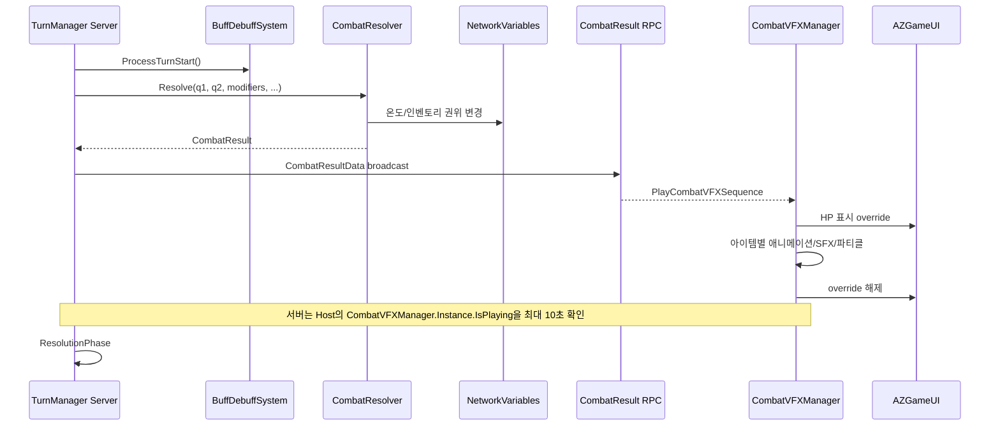

핵심 문제:

- 서버 턴 진행이 Host 로컬 표현 Singleton 상태를 직접 읽는다.
- 원격 클라이언트의 연출 완료는 보장하지 않는다.
- 결과 계산과 표현 시간 계약이 분리되어 있지 않다.

### 5.8 인벤토리 표현

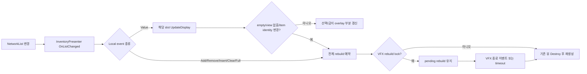

Local inventory의 `Value` 변경은 이미 해당 slot만 부분 갱신한다. 다만 slot이 비었거나 view/item identity가 맞지 않으면 전체 rebuild로 승격된다. `Add`, `Remove`, `Insert`, `Clear`, `Full`과 opponent inventory 변경은 현재 전체 rebuild다. 장점은 VFX 도중 재생성을 잠그고 아이템 ID로 pending selection을 다시 찾는다는 점이며, 개선 대상은 구조 변경 시 전체 파괴·재생성, 문자열 Marker 조회, 바인딩과 입력 책임이 한 클래스에 모인 점이다.

### 5.9 종료와 로비 복귀

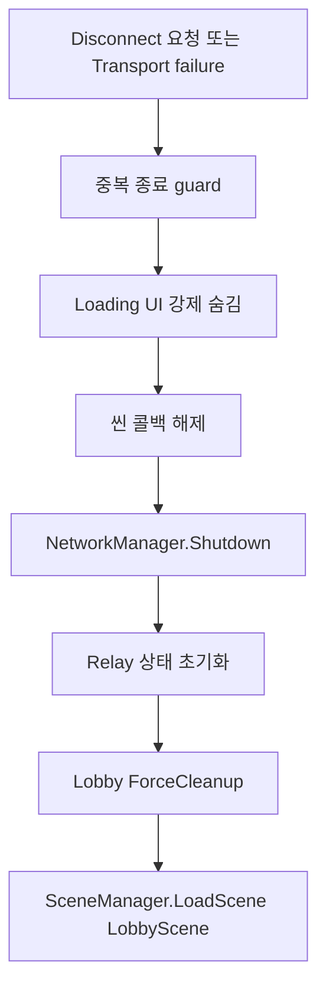

현재 구조는 동기 cleanup 위주이며, Lobby 탈퇴/삭제 같은 원격 I/O 완료와 로컬 종료의 관계가 분리되어 있다.

---

## 6. 목표 설계 원칙

### 6.1 네 개의 계층

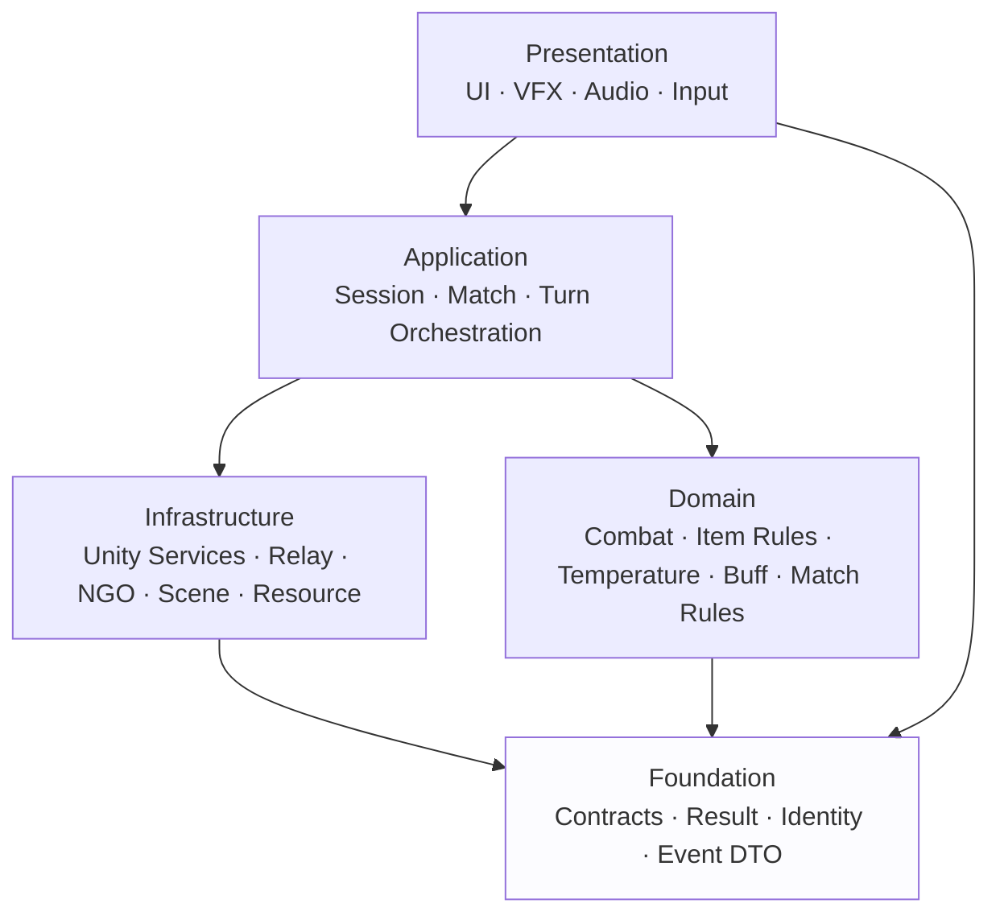

의존 규칙:

- Domain은 UI, NGO, Lobby, Relay를 모른다.
- Infrastructure는 외부 SDK를 프로젝트 계약으로 변환한다.
- Application은 순서를 결정하지만 화면을 직접 만들지 않는다.
- Presentation은 권위 상태를 변경하지 않는다.
- Foundation에는 작은 계약과 값 타입만 둔다.

### 6.2 두 개의 수명 범위

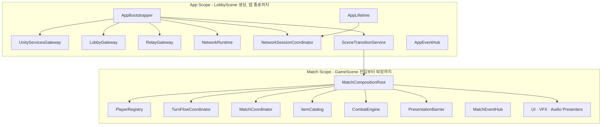

핵심은 Singleton을 전부 없애는 것이 아니다. 앱 루트와 매치 루트 두 곳에서 명시적으로 인스턴스를 연결하고, 하위 시스템이 임의로 전역 탐색하지 않게 만드는 것이다.

---

## 7. 최종 관리 구조

### 7.1 AppBootstrapper

책임:

- Unity Services 초기화와 익명 인증을 한 번만 실행한다.
- App 범위 서비스들을 생성하거나 serialized reference로 받는다.
- 준비 상태를 `Uninitialized / Initializing / Ready / Failed / ShuttingDown`으로 공개한다.
- 앱 종료 토큰을 보유하고 모든 장기 작업을 취소한다.
- UI가 초기화 완료 전 세션 명령을 실행하지 못하게 한다.

하지 않을 일:

- Lobby CRUD 직접 구현
- Relay API 직접 호출
- GameScene의 TurnManager 직접 제어

### 7.2 NetworkSessionCoordinator

UI가 의존하는 단일 Facade다.

```text
CreateHostSessionAsync
  = EnsureReady
  + CreateLobby
  + CreateRelayAllocation
  + Configure/StartHost
  + PublishRelayCode
  + MarkGameStarted
  + LoadGameScene

JoinSessionAsync
  = EnsureReady
  + JoinLobby
  + WaitForRelayCode
  + JoinRelay
  + Configure/StartClient
  + WaitForNetworkScene

DisconnectAsync
  = cancel session lifetime
  + stop polling/heartbeat
  + shutdown NGO
  + best-effort leave/delete lobby
  + clear local snapshot
  + load LobbyScene
```

세션 상태:

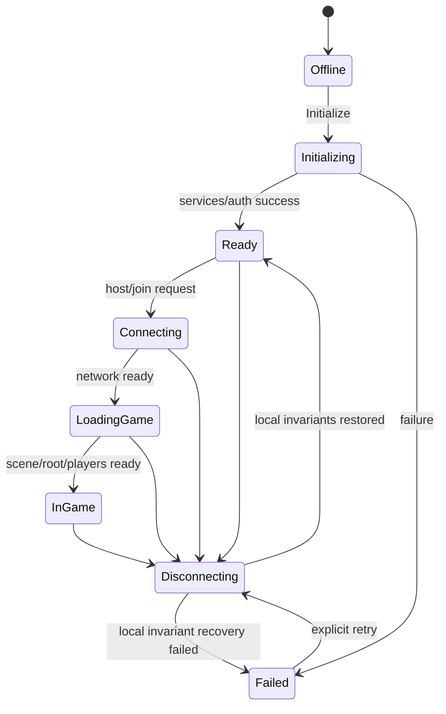

공개 `SessionState`는 `Offline`, `Initializing`, `Ready`, `Connecting`, `LoadingGame`, `InGame`, `Disconnecting`, `Failed`로 유지한다. `Connecting`에서는 `CreatingLobby`, `JoiningLobby`, `WaitingRelayCode`, `AllocatingRelay`, `JoiningRelay`, `StartingHost`, `StartingClient`를, `LoadingGame`에서는 GameScene과 `MatchCompositionRoot` 준비 후 `WaitingForPlayers`를 별도 `SessionOperation`으로 노출한다. 활성 작업이 없으면 `None`이다. 이 분리로 enum 폭증 없이 버튼 중복 클릭, 진행 문구, 중간 실패, 취소, 재시도를 한곳에서 제어한다.

원격 Lobby leave/delete 실패는 warning으로 기록하되 NGO 종료, token 취소, local snapshot 제거와 같은 로컬 cleanup을 끝내고 `Ready`로 복귀한다. 로컬 불변식을 복구하지 못했을 때만 `Failed`로 전이한다. `Failed -> Disconnecting`은 자동 전이가 아니라 사용자가 명시적으로 cleanup 재시도를 요청했을 때만 실행한다.

### 7.3 MatchCompositionRoot

GameScene 진입 시 한 번 다음을 수행한다.

Phase 1에서 Registry owner와 Match 수명만 가진 최소 형태로 먼저 도입하고, Phase 5에서 아래 조립 책임을 확장한다.

1. `TurnManager`, `ItemManager`, `MatchManager`와 표현 시스템 reference를 검증한다.
2. `PlayerRegistry`가 spawn/despawn 이벤트를 통해 플레이어를 등록한다.
3. 서버에서만 Turn/Combat 도메인 서비스를 생성한다.
4. 클라이언트에서 Presenter와 로컬 EventHub를 연결한다.
5. 씬 종료 시 구독, 풀, 토큰을 일괄 해제한다.

### 7.4 TurnManager의 목표 분리

| 현재 책임 | 목표 소유자 |
|---|---|
| NetworkVariable phase snapshot | `TurnNetworkState` 또는 축소된 `TurnManager` |
| 플레이어 탐색과 인덱스 배정 | `PlayerRegistry` |
| Prep 루프 | `TurnFlowCoordinator` |
| 환경 규칙 적용 | `EnvironmentRuleService` |
| 전투 계산 | 기존 `CombatResolver` 기반 `CombatEngine` |
| 라운드 초기화 | `RoundLifecycleService` |
| Host VFX 상태 대기 | `PresentationBarrier` |
| ClientRpc와 DTO broadcast | `TurnNetworkBridge` |

초기 단계에서는 파일을 한 번에 분리하지 않고, 기존 `TurnManager`가 이 객체들을 필드로 보유하도록 바꿔 행동을 유지한다.

### 7.5 Presentation의 목표 분리

| 현재 클래스 | 목표 분리 |
|---|---|
| `AZGameUI` | `GameHudViewBuilder`, `GameHudPresenter`, `ReadyInputPresenter`, `TemperaturePresenter`, `EnvironmentBannerPresenter` |
| `InventoryPresenter` | `InventoryBinder`, `InventoryViewPool`, `InventoryInteractionPresenter` |
| `CombatVFXManager` | `CombatSequencePlayer`, `ItemPresentationRegistry`, `EffectPool`, `CombatAudioPresenter` |
| `EnvironmentVFXManager` | `EnvironmentPresenter`, `EnvironmentAssetCatalog`, 환경별 presentation strategy |

기존 런타임 UI 생성 정책은 유지할 수 있다. 중요한 것은 생성 코드와 상태 바인딩, 사용자 입력, 애니메이션을 서로 다른 객체로 나누는 것이다.

---

## 8. 인터페이스 설계

### 8.1 반드시 필요한 경계 인터페이스

| 인터페이스 | 목적 | 현재 구현 후보 |
|---|---|---|
| `IUnityServicesGateway` | 서비스 초기화와 인증을 SDK에서 분리 | `LobbyManager.InitializeServices` 추출 |
| `ILobbyGateway` | Lobby CRUD와 snapshot 조회 | `LobbyManager`의 API 호출부 |
| `IRelayGateway` | allocation/join code/join allocation | `RelayManager`의 Relay SDK 호출부 |
| `INetworkRuntime` | NGO 시작·종료·Transport 설정 | `NetworkManager`/`UnityTransport` adapter |
| `ISceneTransitionService` | 네트워크 씬 로드와 로컬 로비 복귀 | `SessionManager` 분리 |
| `IReadOnlyPlayerRegistry` | ClientId, PlayerIndex, PlayerBinding 조회 | `PlayerSpawnManager` + TurnManager 탐색 로직 |
| `ILocalEventHub` | 매치 수명 범위의 typed local events | 기존 static events 대체 |
| `IPresentationBarrier` | 전투 연출 완료/timeout의 서버 계약 | TurnManager의 Host `IsPlaying` 확인 대체 |

### 8.2 선택적으로 가치가 있는 인터페이스

| 인터페이스 | 사용할 때 |
|---|---|
| `ITimeSource` / `IServerClock` | NetworkTime과 Unity Time을 테스트에서 대체할 때 |
| `IRandomSource` | 아이템 드롭과 환경 선택을 결정론적으로 테스트할 때 |
| `ICombatResolver` | 다른 AI/규칙 버전 또는 단위 테스트 대역이 필요할 때 |
| `IItemCatalog` | ItemId와 SO registry 접근을 한곳으로 제한할 때 |
| `IMatchResettable` | 턴/라운드/매치 reset 단계를 일괄 실행할 때 |
| `ICombatSequencePlayer` | VFX 실행과 서버 presentation barrier를 분리할 때 |
| `IObjectPool<T>` | 반복 생성되는 표현 객체가 자신의 반환 경계를 알아야 할 때 |

### 8.3 인터페이스로 만들지 않을 것

- 단순 DTO와 enum
- 교체 가능성이 없는 작은 MonoBehaviour
- ItemDataSO의 모든 하위 타입
- `NetworkVariable` 자체를 숨기기 위한 의미 없는 wrapper
- 모든 Manager에 이름만 같은 `IManager`

### 8.4 계약 예시

```csharp
public interface IReadOnlyPlayerRegistry
{
    bool TryGetByPlayerIndex(byte playerIndex, out PlayerBinding player);
    bool TryGetByClientId(ulong clientId, out PlayerBinding player);
    IReadOnlyCollection<PlayerBinding> Players { get; }
    int ReadyCount { get; }
    event Action<PlayerBinding> Registered;
    event Action<PlayerIdentity> Unregistered;
}

public readonly struct PlayerIdentity
{
    public readonly byte PlayerIndex;
    public readonly ulong ClientId;
}

public sealed class PlayerBinding
{
    public PlayerIdentity Identity { get; }
    public readonly PlayerState State;
    public readonly PlayerInventory Inventory;
    public readonly NetworkObject NetworkObject;
}
```

`PlayerIdentity`는 순수 값이고, `PlayerBinding`은 Match 수명에 연결된 Unity 객체다. 이 둘을 분리하면 despawn된 객체 참조가 foundation 값처럼 오래 남는 것을 막으면서 `ClientId == PlayerIndex`라는 암묵적 가정도 제거할 수 있다. 일반 consumer에는 조회 전용 registry 계약만 제공하고 등록/해제 권한은 spawn/composition 경로로 제한한다. `OnNetworkSpawn` 시 `SyncedPlayerIndex == -1`이면 ClientId 기반 pending 상태로 두고 index 0/1이 복제된 후에만 `Players`에 승격해 `Registered`를 한 번 발행한다. despawn 시에는 index 구독을 먼저 해제하고 cached identity로 `Unregistered`를 발행한다.

```csharp
public interface ILobbyGateway
{
    Task<Result<LobbySnapshot>> CreateAsync(
        CreateLobbyRequest request,
        CancellationToken cancellationToken);

    Task<Result<LobbySnapshot>> JoinByCodeAsync(
        string code,
        CancellationToken cancellationToken);

    Task<Result<LobbySnapshot>> RefreshAsync(
        string lobbyId,
        CancellationToken cancellationToken);

    Task<Result> LeaveAsync(
        LobbySnapshot lobby,
        CancellationToken cancellationToken);
}
```

외부 SDK의 예외와 null 반환을 `Result`로 정규화하면 UI가 실패 이유를 명확히 표시할 수 있다.

---

## 9. 비동기 최종 정책

### 9.1 한 가지 방식으로 통일하지 않는다

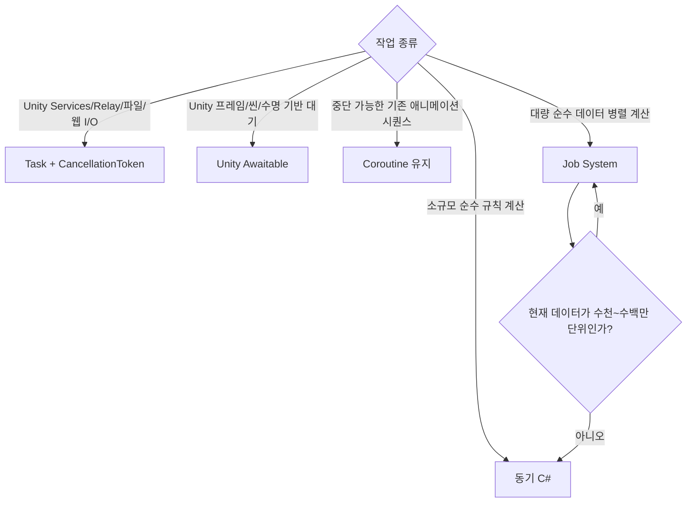

### 9.2 선택 기준

| 방식 | Absolute Zero 사용처 | 취소 | 주의점 |
|---|---|---|---|
| `Task` | Lobby, Relay, Authentication, 장치 I/O | 세션 CTS + generation 검증 | 설치된 Lobby/Relay SDK 호출 자체는 token을 받지 않으므로 늦은 결과의 commit을 차단 |
| `Awaitable` | 씬/프레임 대기, 로딩 연출, 새 로컬 sequence | `destroyCancellationToken` 또는 scope token | 같은 Awaitable 인스턴스를 여러 번 await하지 않음 |
| Coroutine | 기존 Combat/Environment/MiniGame VFX | Coroutine handle/Stop | 전면 교체하지 말고 경계부터 정리 |
| Job System | 현재 미사용 | JobHandle/Native container | 2인 턴 계산에는 도입하지 않음 |
| Background thread | 압축, 큰 파싱 같은 Unity API 비접촉 CPU 작업 | app exit token | 완료 전 `MainThreadAsync`로 복귀 |

### 9.3 목표 초기화 흐름

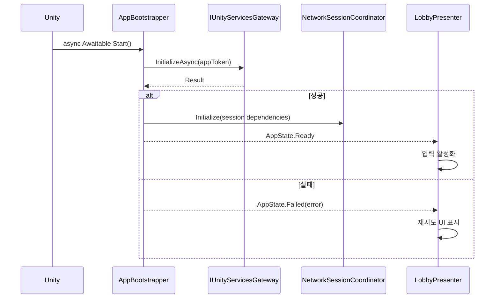

### 9.4 Heartbeat와 Polling

현재 `Update` timer + `async void` 구조를 수명 기반 loop로 전환한다.

```text
LobbySession 시작
  ├─ HostHeartbeatLoopAsync(sessionToken)
  └─ LobbyPollingLoopAsync(sessionToken)

각 loop 규칙
  1. 이전 요청 완료 후 다음 interval 대기
  2. 동시에 두 요청 실행 금지
  3. lobby snapshot을 지역 변수로 캡처
  4. sessionToken 취소는 정상 종료
  5. NotFound는 SessionExpired 상태로 전환
  6. 일시 오류는 backoff 후 재시도
```

Lobby interval은 게임 `timeScale`과 무관해야 하므로 `Task.Delay(interval, token)`이 적합하다. 반대로 화면 애니메이션과 프레임 동기화에는 `Awaitable`이 적합하다.

현재 설치된 Lobby `1.3.0`과 Relay `1.0.5`의 공개 SDK 메서드는 `CancellationToken`을 직접 받지 않는다. 따라서 token은 loop와 caller 수명을 취소하는 데 사용하고, 이미 시작된 SDK 호출은 `OperationGeneration`을 캡처해 완료 후 현재 operation과 일치할 때만 상태에 반영한다.

### 9.5 `async void` 규칙

- Unity 이벤트와 Button callback의 얇은 entry point에서만 허용한다.
- 실제 로직은 반드시 `Task` 또는 `Awaitable` 반환 메서드로 위임한다.
- entry point는 `try/catch/finally`로 취소, 오류, UI busy 상태를 처리한다.
- Manager와 Gateway 내부에는 `async void`를 두지 않는다.
- fire-and-forget은 명시적 helper에서 오류를 관찰하고 수명 토큰을 받는다.

### 9.6 취소 토큰 계층

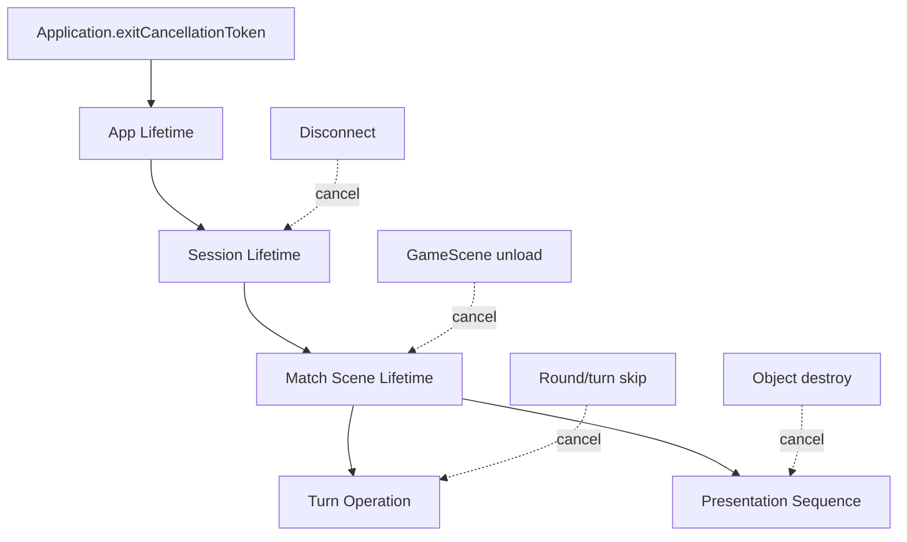

---

## 10. 이벤트 최종 정책

### 10.1 상태와 이벤트 구분

| 종류 | 전달 방식 | 예시 |
|---|---|---|
| 재접속 후에도 알아야 하는 공유 상태 | `NetworkVariable` / `NetworkList` | 온도, Phase, 점수, 인벤토리 |
| 서버에서 한 번 발생한 네트워크 명령 | RPC + serializable DTO | 전투 결과, 환경 연출 시작 |
| 한 클라이언트 내부의 파생 알림 | `ILocalEventHub` 또는 직접 C# event | HP 표시 갱신, VFX 완료, 버튼 상태 |
| 정적 설정 | ScriptableObject read-only catalog | ItemData, VisualAssetCatalog, AudioCatalog |

### 10.2 권장 로컬 이벤트

- `CombatResultReceived`
- `CombatPresentationStarted`
- `CombatPresentationCompleted`
- `InventorySnapshotChanged`
- `EnvironmentPresentationRequested`
- `LocalPlayerBound`
- `SessionStateChanged`

이 이벤트들은 네트워크 권위 데이터를 대체하지 않는다. Presenter가 서로의 concrete Singleton을 직접 찾지 않도록 연결하는 용도다.

### 10.3 Static event 제거 순서

1. 기존 static event 구독자를 목록화한다.
2. MatchCompositionRoot가 소유하는 EventHub 인스턴스를 추가한다.
3. 발행을 static event와 EventHub에 잠시 이중 연결한다.
4. 구독자를 하나씩 EventHub로 이동한다.
5. 씬 재진입 테스트 후 static event를 제거한다.

---

## 11. 목표 기능 흐름

### 11.1 Host 세션

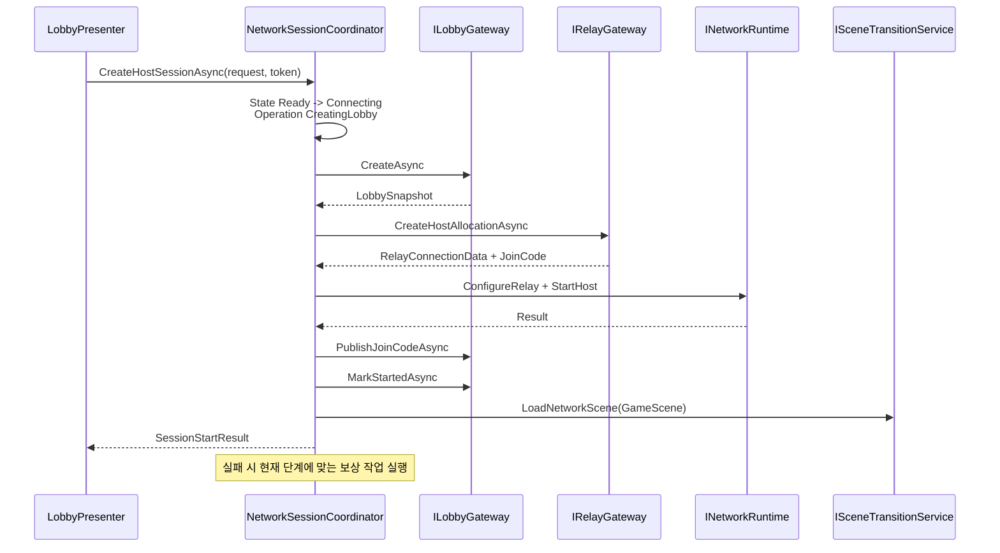

### 11.2 Client 세션

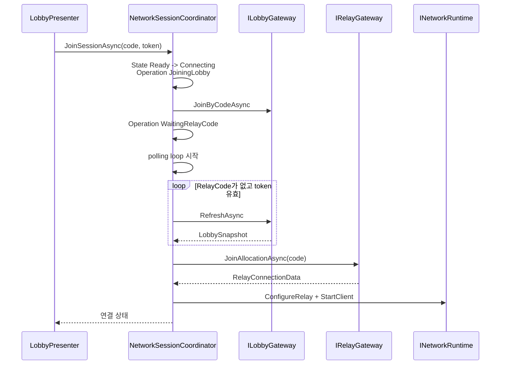

### 11.3 Match 진입

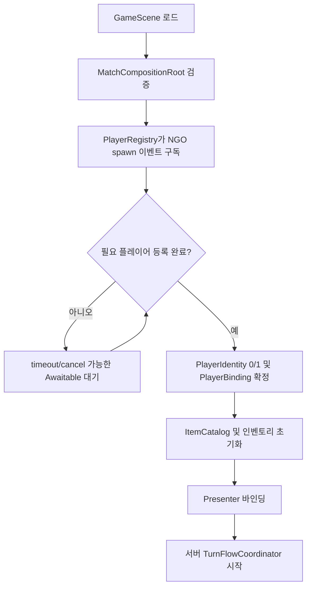

### 11.4 목표 턴 흐름

```mermaid
flowchart TD
    A[TurnFlowCoordinator] --> B[BeginPrep]
    B --> C[turn/modifier reset + 환경 Prep 작업]
    C --> D[Prep 입력·이모트 open + 온도/회복 tick]
    D --> E{2명 ready / timeout / death}
    E -- death --> K[RoundLifecycleService]
    E -- ready/timeout --> O[미Ready 강제 + 임시 fan 복구]
    O --> P[이모트 접수 종료 + 마지막 표시만 대기]
    P --> Q[Attack delayed effect 처리]
    Q --> F[CombatEngine.Resolve]
    F --> G[uint resultSequence 발급]
    G --> H[PresentationBarrier.Begin participants]
    H --> N[TurnNetworkBridge.Broadcast Result]
    N --> I{양쪽 ACK 또는 timeout}
    I --> J[Resolution rules]
    J --> L{match complete?}
    L -- 아니오 --> B
    L -- 예 --> M[MatchComplete]
```

매치 범위의 `uint resultSequence`를 사용하면 오래된 VFX 완료 신호가 다음 턴을 해제하는 문제를 방지할 수 있다. Barrier는 반드시 RPC broadcast 전에 열어 빠른 ACK가 등록 전에 도착하는 race를 막는다.

### 11.5 목표 인벤토리 표현

```mermaid
flowchart LR
    A[NetworkListEvent] --> B[InventoryBinder]
    B --> C{변경 종류}
    C -->|Value| D[해당 ItemWorldView만 Patch]
    C -->|Add| E[Pool에서 View Get]
    C -->|Remove| F[View를 Pool Release]
    C -->|Full reset| G[Snapshot diff]
    D --> H[Selection/Banned Presenter]
    E --> H
    F --> H
    G --> H
```

---

## 12. 최적화 설계

### 12.1 우선순위 원칙

최적화는 다음 순서로 수행한다.

1. 잘못된 알고리즘과 중복 작업 제거
2. 객체 수명과 구독 누수 제거
3. 반복 검색과 문자열 의존 제거
4. 빈번한 할당과 Destroy 제거
5. 네트워크 전송량과 빈도 최적화
6. Profiler 근거가 있을 때만 Job/Background thread 도입

### 12.2 CPU와 조회 최적화

| 현재 | 목표 | 효과 |
|---|---|---|
| TurnManager가 플레이어를 반복 검색 | PlayerRegistry spawn/despawn 등록 | 전체 씬 검색 제거, ID 매핑 일원화 |
| Marker를 이름으로 반복 탐색 | `SceneReferenceCatalog`에서 한 번 캐시 | 문자열 오류와 검색 비용 감소 |
| 각 Manager가 다른 Manager를 찾음 | Composition Root가 명시적 연결 | 초기화 순서와 null race 감소 |
| 아이템별 긴 분기 | `ItemPresentationRegistry`의 strategy lookup | 분기 복잡도와 변경 범위 감소 |
| Lobby Update timer + 중첩 I/O | 취소 가능한 단일 loop | 중복 요청과 race 감소 |

### 12.3 메모리와 GC 최적화

우선 풀링 후보:

1. 전투 Hit/IceBreak/FinalBreak 파티클
2. `EmoteBubble`
3. `ItemWorldView`
4. 반복 생성되는 미니게임 보조 오브젝트
5. 환경 NPC/blanket처럼 라운드마다 생성되는 표현 객체

풀링 제외:

- Player NetworkObject
- DDOL Manager
- 매우 드물게 한 번 생성되는 전체 Canvas
- 상태 초기화 비용이 생성 비용보다 큰 객체

풀 계약:

```text
Create  : 필수 컴포넌트와 불변 reference 연결
Get     : 위치, 표시 데이터, 이벤트, animator state 초기화
Release : 이벤트 해지, coroutine/async 취소, target 제거, 비활성화
Destroy : pool 자체 종료 시 Unity object 제거
```

### 12.4 UI 최적화

- `AZGameUI`의 구조 생성은 씬 진입 시 한 번만 수행한다.
- 값 변경은 Presenter가 해당 위젯만 갱신한다.
- `Update()`에는 연속 보간과 billboard처럼 매 프레임 필요한 로직만 둔다.
- 점수, Phase, 환경명은 이벤트 기반으로 갱신한다.
- Inventory는 전체 재빌드보다 NetworkList event 기반 부분 갱신을 우선한다.
- UI callback에서 중복 async 명령을 막도록 busy state와 session state를 사용한다.

### 12.5 네트워크 최적화

현재 이미 좋은 부분:

- `ItemSlotNetData`가 4-byte compact struct다.
- `RemainingTime`은 값이 변할 때만 기록된다.
- 권위 계산은 서버에서 수행하고 결과 DTO를 broadcast한다.
- VFX용 중간 프레임을 네트워크로 전송하지 않는다.

추가 개선:

- `PlayerIdentity`와 Match 수명의 `PlayerBinding`으로 ID 도메인과 Unity 참조를 분리한다.
- 전투 결과에 `uint ResultSequence`와 ACK/timeout 계약을 추가한다.
- 작은 ClientRpc를 여러 개 호출하는 연출은 하나의 결과 DTO로 묶는다.
- late join이 필요한 정보는 event가 아니라 NetworkVariable snapshot에 둔다.
- Lobby polling은 게임 중 중단하고 세션 상태가 필요할 때만 실행한다.

### 12.6 리소스 최적화

1단계:

- `GameSprites`, Audio mapping, FPS/환경 리소스를 typed catalog SO로 통합한다.
- 반복 `Resources.Load`를 catalog 초기화 한 번으로 줄인다.
- 문자열 경로는 catalog 생성 시에만 검증한다.

2단계 선택 사항:

- 대형 비네트워크 VFX, 음원, 환경 아트를 Addressables group으로 이동한다.
- handle ownership과 release를 resource service가 전담한다.
- Player NetworkPrefab과 필수 Item SO는 초기 단계에 이동하지 않는다.

### 12.7 컴파일 최적화

목표 asmdef 방향:

```mermaid
flowchart TB
    F[AbsoluteZero.Foundation] --> D[AbsoluteZero.Domain]
    F --> N[AbsoluteZero.Networking]
    D --> A[AbsoluteZero.Application]
    N --> A
    F --> P[AbsoluteZero.Presentation]
    A --> P
    T[AbsoluteZero.Tests] --> D
    T --> A
```

도입 전 조건:

- UI/Core의 상호 참조를 정리한다.
- `TurnManager`가 Presentation concrete type을 참조하지 않게 한다.
- static Singleton 접근을 composition reference로 일부 이동한다.
- asmdef는 전부 도입하거나 명확한 경계로 도입해 Assembly-CSharp가 모든 모듈을 다시 참조하는 상태를 피한다.

---

## 13. 단계적 적용 계획

세부 파일, 전환 순서, 검증 매트릭스와 중단 조건은 `Docs/Plans/PLAN_018_architecture_migration.md`를 따른다. 아래는 전체 구조를 이해하기 위한 요약이다.

### Phase 0 — 행동 보존 기준선

목표: 리팩터링 전 현재 행동을 기록한다.

- Host/Client 로비 생성·참가·게임 시작 smoke test
- 턴 1회, 라운드 reset, 매치 종료 로그 캡처
- Item/Environment/Minigame 주요 시나리오 체크리스트
- ClientId와 PlayerIndex 로그 포맷 통일
- Unity Profiler에서 GC Alloc, Instantiate/Destroy, UI rebuild 기준선 기록

### Phase 1 — Player Identity vertical slice

목표: 가장 위험한 암묵적 식별 계약을 실제 spawn → registry → Turn/VFX 흐름에서 제거한다.

- 순수 값 `PlayerIdentity`와 Match 수명의 `PlayerBinding` 분리
- 최소 `MatchCompositionRoot`가 GameScene에서 Registry를 생성·소유·폐기
- idempotent read-only `PlayerRegistry` 계약 도입
- spawn/`OnNetworkSpawn` 이후 등록, despawn/disconnect 시 해제
- TurnManager player polling, CombatVFX identity cast, `PlayerState.BuildContext()`의 단일 opponent 조회를 registry lookup으로 교체
- 현재 2인 기준의 ClientId 오름차순 PlayerIndex 배정 정책 보존. 이는 4인/reconnect 최종 seat 정책이 아님

위험도: 중간. Host/remote Client, round reset, disconnect 검증 필수.

### Phase 2 — Combat result sequence와 PresentationBarrier

목표: 서버 진행을 Host 로컬 VFX 상태에서 분리한다.

- `CombatResultData`에 매치 범위 `uint ResultSequence` 추가
- required participant snapshot으로 barrier를 RPC broadcast 전에 시작
- sender-validated ACK, duplicate/late ACK 무시, disconnect 제거, timeout 처리
- Combat VFX Coroutine은 유지하되 종료의 단일 경로에서 ACK
- TurnManager의 Host `CombatVFXManager.Instance.IsPlaying` 확인 제거

위험도: 높음. result 직렬화와 Host/Client 타이밍 검증 필수.

### Phase 3 — 네트워크 비동기 통합

목표: Lobby/Relay/NGO/Scene 흐름을 단일 상태 머신으로 통합한다.

- heartbeat/polling in-flight guard와 `OperationGeneration`을 먼저 도입
- Unity Services/Lobby/Relay/NGO/Scene gateway 추출
- gateway 경계에 `Result` / `Result<T>`와 구조화된 오류 도입
- `NetworkSessionCoordinator` 상태 머신과 부분 실패 compensation 추가
- UI는 Coordinator facade만 호출
- 설치 SDK가 token을 받지 않는 호출은 늦은 결과의 state commit을 차단

위험도: 높음. 로비 전체 회귀 테스트 필수.

### Phase 4 — App Composition Root

목표: Persistent Manager 초기화 순서와 App/Session 수명을 한곳에 모은다.

- `AppBootstrapper`가 기존 manager 누락/중복과 초기화 순서를 먼저 검증
- App/Session lifetime token 도입
- 개별 DDOL 제거는 manager 한 개씩 안전하게 이전
- bootstrapper는 조립만 담당하고 gameplay god object가 되지 않음

### Phase 5 — Match Composition과 TurnManager 책임 분리

목표: GameScene binding을 통합하고 권위 상태 머신은 유지하면서 규칙과 network publication 책임을 줄인다.

- Phase 1의 `MatchCompositionRoot`를 확장해 scene 검증과 server/client consumer binding 통합
- Environment authoritative rule과 presentation staging 분리
- Round reset을 idempotent server-only service로 추출
- RPC는 의미 있는 publication seam을 먼저 만든 뒤 필요할 때만 별도 NetworkBehaviour로 이동
- phase state를 쓰는 driver는 계속 하나만 유지
- `_p1`/`_p2`는 Registry projection bridge를 거쳐 collection iteration으로 제거하되 전투 결과는 현재 1대1 규칙을 그대로 유지
- `PlayerModifiers[2]` literal을 match seat 수로 생성되는 collection으로 전환하되 PLAN_018 runtime 길이는 2로 유지
- `ItemContext -> 7개 ItemDataSO.ExecuteEffect` mutation을 먼저 기록하고 attack/recovery/defense → buff/debuff → sabotage/special 순서로 pure context + typed outcome 경계로 이전
- ItemDataSO는 immutable authoring config로 남기고 adapter가 pure `ItemEffectSpec`을 만들어 Domain strategy에 전달
- Reroll/Steal/DropTable random은 `IRandomSource`로 전달해 live에서는 Unity random adapter, test에서는 고정 sequence를 사용
- PlayerState는 RPC ingress/replicated state holder로 유지하되 `TurnManager.Instance` 대신 명시적으로 bind된 intent sink/coordinator에 검증을 위임
- temperature/modifier/inventory/scheduled effect outcome은 coordinator만 NetworkVariable/NetworkList에 적용
- category마다 현재 1대1 golden result와 item consumption을 비교한 뒤 compatibility adapter 제거

### Phase 6 — Presentation 분리와 풀링

목표: 큰 UI/VFX 클래스와 반복 생성 비용을 줄인다.

- profiler로 high-churn 대상 재측정
- Unity `ObjectPool<T>`로 EmoteBubble/Combat particle부터 적용
- ItemWorldView는 slot compaction/identity 안정화 후 incremental update + pool 적용
- typed Visual/Audio catalog
- AZGameUI는 책임과 수명이 독립적인 영역만 builder/presenter로 분리
- Item presentation strategy registry

### Phase 7 — asmdef와 테스트

목표: 의존 방향을 컴파일러가 강제한다.

- Foundation / Domain / Networking / Application / Presentation / Tests
- pure domain EditMode tests
- session adapter contract tests
- network PlayMode smoke tests

### Phase 8 — Addressables 선택 도입

조건:

- Resources가 빌드 메모리나 로드 시간 병목으로 측정됨
- 리소스 카탈로그가 먼저 정리됨
- handle lifetime과 실패 fallback 설계가 완료됨

### PLAN_018과 향후 4인 확장의 경계

PLAN_018은 현재 1대1 행동을 보존하는 구조 마이그레이션이다. 새 API를 collection 기반으로 만들고 pair 하드코딩을 제거하지만, 4인 target selection·전투 규칙·승리 조건·UI는 구현하지 않는다. 실제 4인 기능은 `Docs/Plans/PLAN_019_four_player_expansion.md`에서 별도로 진행한다.

```mermaid
flowchart LR
    A[PLAN_018\n1대1 행동 보존] --> B[Registry collection\n명시적 identity]
    B --> C[Pure Domain command/result\nNetwork DTO 분리]
    C --> D{GAME_DESIGN\n4인 규칙 확정}
    D --> E[PLAN_019\n2~4인 roster와 gameplay]
```

4인 준비에서 중요한 것은 배열 크기를 4로 늘리는 것이 아니라 ID와 정보 공개 범위를 분리하는 것이다.

```text
ParticipantId : reconnect 전후에도 같은 참가자를 식별
PlayerIndex   : 매치 동안 고정된 0..3 seat
ClientId      : 현재 NGO 연결, reconnect 시 바뀔 수 있음
OwnerClientId : 현재 NetworkObject owner
ViewRole      : 각 client에서 local/remote로 보이는 관계
```

향후 roster의 정책상 좌석은 `PlayerSeat`라고 부르고 그 숫자 key가 `PlayerIndex`다. `PlayerSlot`이라는 이름은 사용하지 않는다. 이 프로젝트에서 slot은 `PlayerInventory.SlotStates`의 0..11 inventory 위치를 뜻하므로 identity/roster 용어와 분리한다. `PlayerRegistry`는 현재 spawn된 Unity binding 조회를, Match Roster는 disconnect·elimination·reconnect 정책을 소유한다.

현재 2인 호환을 위한 ClientId 오름차순 배정은 PLAN_018에서 유지하지만, PLAN_019에서는 match 시작 전에 서버 roster가 seat를 확정하고 disconnect/reconnect 중에도 재정렬하지 않는다.

씬 진입의 `RequiredPlayerCount`와 매 턴 입력을 기다리는 `EligibleActorCount`도 구분한다. 탈락·disconnect 이후에도 모든 seat의 Ready를 기다리면 턴이 멈추므로, turn 시작 시 roster가 eligible actor snapshot을 제공하고 phase driver와 UI가 같은 집합을 사용한다. `P1RoundWins`/`P2RoundWins` 역시 4인 단계에서 roster-indexed match score collection으로 이전한다.

동기화도 하나의 거대한 PlayerSnapshot으로 합치지 않는다.

현재 `PlayerState`의 8개 NetworkVariable은 다음처럼 판단한다. 4인일 때 32개라는 숫자만으로 최적화하지 않고, 실제 payload와 atomic update 필요를 측정하기 전에는 개별 필드를 유지하는 것이 기본 결정이다.

| 현재 필드 | 의미 그룹 | 목표 판단 |
|---|---|---|
| `SyncedPlayerIndex` | identity | 서버가 한 번 확정하는 별도 값 |
| `Temperature`, `FanSpeed` | 공개 thermal state | 함께 원자적으로 바꿔야 할 때만 grouping |
| `IsReady`, `IsFanActive`, `HasSelectedItem` | turn-visible state | 선택 item/target 자체는 포함하지 않음 |
| `IsFanUpgraded`, `IsBasicBlocked` | rule/modifier state | reset lifetime 안정화 전 개별 유지 |

게임에는 별도 `Health` 값이 없고 사망은 Temperature 규칙에서 계산한다. `IsAlive`도 현재 저장 상태가 아니며, score는 PlayerState가 아니라 MatchManager의 round wins 책임이다.

| 데이터 | 위치 | 이유 |
|---|---|---|
| 온도, 공개 fan/ready 상태 | public replicated state | late join/reconnect 복원 필요 |
| 생존 표시 | Temperature에서 계산하는 derived view | 별도 `IsAlive` 저장 상태를 만들지 않음 |
| PlayerIndex | 별도 identity state | match 동안 한 번 확정 |
| Inventory | NetworkList | slot별 증분 변경 의미가 있음 |
| 선택 item, target, sub-action, ready order | server-only ActionIntent | reveal 전 상대에게 노출되면 안 됨 |
| 전투 결과 | bounded RPC batch | 한 번만 발생하는 ordered presentation 명령 |

현재 item ID가 `short`와 `-1` sentinel을 사용하므로 4인 DTO도 별도 schema migration 전까지 같은 폭을 유지한다. NetworkVariable 개수 감소 자체를 최적화 목표로 삼지 않고 authority, visibility, lifetime, update cadence가 같은 필드만 묶는다.

`PlayerModifiers[2]` literal은 PLAN_018에서 runtime 길이 2의 seat-indexed collection으로 먼저 바꾸고, PLAN_019에서 그 collection의 크기를 MatchConfig의 `RequiredPlayerCount`까지 활성화한다. InventoryPresenter의 단일 `_opponentPlayer`/`_opponentInventory`는 PLAN_019에서 local interactive 1개 + remote read-only keyed collection으로 전환한다. 탈락이나 reconnect가 발생해도 seat를 재번호화하지 않는다.

4인 전투는 player당 결과 하나가 아니라 ordered event batch로 모델링한다.

```text
server-only ActionIntent[]
-> immutable MatchCombatSnapshot
-> deterministic order + target policy
-> pure CombatEngine
-> ordered CombatEvent[] + final PlayerStateDelta[]
-> CombatResolutionBatchNetData
-> client presentation + ACK
```

Domain의 `ActionIntent`, `CombatResolution`은 NGO를 참조하지 않는다. `INetworkSerializable` 구현은 Networking DTO에만 두고 `TurnNetworkBridge`가 변환한다. 이를 통해 순수 전투 테스트가 NGO spawn 없이 실행되고 wire schema 변경이 gameplay 규칙으로 번지지 않는다.

4인 구현 전 `GAME_DESIGN.md`에서 최소한 지원 인원, target 종류, action order, 동시 사망, 승리, disconnect/reconnect, inventory/action 공개 범위, VFX 순차/병렬 정책을 확정해야 한다.

---

## 14. 최종 권장 디렉터리

현재 `.meta` GUID를 보존해야 하므로 한 번에 이동하지 않는다. 아래는 점진적으로 도달할 목표다.

```text
Assets/Scripts/
├── Foundation/
│   ├── Contracts/
│   ├── Results/
│   ├── Identity/
│   └── Events/
├── Domain/
│   ├── Combat/
│   ├── Items/
│   ├── Temperature/
│   ├── Buffs/
│   └── Match/
├── Application/
│   ├── Bootstrap/
│   ├── Session/
│   ├── Turn/
│   └── Match/
├── Infrastructure/
│   ├── UnityServices/
│   ├── Networking/
│   ├── Scenes/
│   └── Resources/
├── Presentation/
│   ├── UI/
│   ├── Inventory/
│   ├── Combat/
│   ├── Environment/
│   ├── Audio/
│   └── MiniGames/
└── Tests/
    ├── EditMode/
    └── PlayMode/
```

실제 이동은 Unity Editor를 통해 `.meta` 파일과 함께 수행하고, Phase별로 컴파일과 prefab/scene reference를 확인한다.

---

## 15. 적용 후 최종 시스템 지도

```mermaid
flowchart TB
    User[사용자 입력] --> Present[Presentation]
    Present --> SessionFacade[NetworkSessionCoordinator]
    Present --> InputBridge[Player Input/RPC Bridge]

    subgraph App[App Scope]
        Boot[AppBootstrapper]
        Services[UnityServicesGateway]
        Lobby[LobbyGateway]
        Relay[RelayGateway]
        Net[NetworkRuntime]
        Scene[SceneTransitionService]
        SessionFacade
    end

    subgraph Match[Match Scope]
        Root[MatchCompositionRoot]
        Registry[PlayerRegistry]
        Flow[TurnFlowCoordinator]
        Engine[CombatEngine]
        Rules[Item/Temperature/Buff/Environment Rules]
        Bridge[TurnNetworkBridge]
        Barrier[PresentationBarrier]
        EventHub[LocalEventHub]
    end

    Boot --> Services
    Boot --> SessionFacade
    SessionFacade --> Lobby
    SessionFacade --> Relay
    SessionFacade --> Net
    SessionFacade --> Scene
    Scene --> Root

    Root --> Registry
    Root --> Flow
    Flow --> Engine
    Engine --> Rules
    Flow --> Bridge
    Bridge --> EventHub
    EventHub --> Present
    Present --> Barrier
    Barrier --> Flow
    InputBridge --> Bridge

    Net -.NGO state.-> Bridge
```

최종 구조에서 관리 주체는 다음 세 개로 명확해진다.

1. `AppBootstrapper`: 앱 수명과 초기화
2. `NetworkSessionCoordinator`: 로비부터 게임 입장·종료까지의 세션 흐름
3. `MatchCompositionRoot` + `TurnFlowCoordinator`: GameScene 구성과 서버 권위 매치 흐름

나머지 시스템은 이 관리 주체가 연결한 계약을 통해 일하며, 임의로 전체 씬이나 Singleton을 탐색하지 않는다.

---

## 16. 성공 판단 기준

구조 개선은 파일 수가 늘어난 것으로 성공을 판단하지 않는다. 다음 조건을 만족해야 한다.

- UI가 Lobby/Relay/Session Manager 세 개를 직접 조립하지 않는다.
- 서비스 초기화 완료 전 세션 명령이 실행되지 않는다.
- Lobby polling과 heartbeat가 중첩 실행되지 않고 disconnect 시 취소된다.
- `ClientId`, `PlayerIndex`, Owner를 타입과 registry로 구분한다.
- 새 match API는 collection 기반이며 `_p1`/`_p2`, `1 - index`, ClientId-as-seat 가정을 추가하지 않는다.
- TurnManager가 `CombatVFXManager.Instance.IsPlaying`을 직접 읽지 않는다.
- GameScene 진입 후 플레이어와 Manager 전체 검색이 반복되지 않는다.
- Inventory 변경이 가능한 경우 해당 뷰만 갱신된다.
- 반복 VFX와 이모트에 Instantiate/Destroy가 지속적으로 발생하지 않는다.
- Domain 코드는 NGO와 Unity UI 없이 단위 테스트할 수 있다.
- 씬 재진입 후 static event 또는 async 작업이 남지 않는다.
- Host와 Client에서 라운드 2회 이상 연속 진행이 동일하게 동작한다.
- 비공개 item/target intent가 Everyone-readable snapshot으로 복제되지 않는다.

위 조건은 PLAN_018의 1대1 구조 마이그레이션 성공 기준이다. 4인 완료 판정은 PLAN_019의 Host + remote client 3개, 모든 seat, 다중 target, disconnect/reconnect gate를 별도로 통과해야 한다.

---

## 17. 공식 기술 근거

- Unity `Awaitable`은 Unity 프레임 대기와 메인/백그라운드 스레드 전환을 제공하지만, 풀링된 인스턴스이므로 동일 인스턴스를 여러 번 await하면 안 된다: <https://docs.unity3d.com/ja/current/ScriptReference/Awaitable.html>
- Unity API가 반환하는 Awaitable은 일반적으로 메인 스레드에서 완료되며, 백그라운드 작업 후 Unity API 사용 전에는 메인 스레드로 복귀해야 한다: <https://docs.unity3d.com/kr/6000.0/Manual/async-awaitable-continuations.html>
- `Awaitable.WaitForSecondsAsync`는 취소 토큰을 받을 수 있다: <https://docs.unity3d.com/ja/current/ScriptReference/Awaitable.WaitForSecondsAsync.html>
- NGO의 current API는 universal `[Rpc]`를 권장하며 `ClientRpc`/`ServerRpc`를 legacy로 분류한다. 신규 코드는 universal RPC를 사용하되 기존 호출의 일괄 변경은 별도 migration gate로 다룬다: <https://docs-multiplayer.unity3d.com/netcode/current/advanced-topics/message-system/rpc/>
- NGO NetworkVariable은 Everyone/Owner read permission과 server/owner write permission을 구분하며 custom `INetworkSerializable` 상태를 지원한다. Snapshot은 필드 수가 아니라 visibility와 update semantics로 묶는다: <https://docs-multiplayer.unity3d.com/netcode/current/basics/networkvariable/>
- Unity `IObjectPool<T>`는 `Get`, `Release`, `Clear`를 제공하는 풀 경계다: <https://docs.unity3d.com/ja/current/ScriptReference/Pool.IObjectPool_1.html>
- asmdef는 의존성이 명확한 별도 어셈블리를 만들어 변경 시 필요한 범위만 재컴파일하게 한다: <https://docs.unity3d.com/kr/current/Manual/assembly-definitions-creating.html>

---

## 18. 다음 실행 권고

실제 코드는 `Docs/Plans/PLAN_018_architecture_migration.md`의 Phase 0과 Phase 1부터 진행하는 것이 안전하다. 첫 구현 단위는 아래 순서가 적합하다.

1. 현재 Host/remote Client 흐름과 identity 로그를 characterization
2. `PlayerIdentity`, `PlayerBinding`, 조회 전용 `PlayerRegistry` 계약
3. spawn/despawn 등록과 TurnManager lookup 교체
4. CombatVFXManager의 local/opponent 변환 교체
5. Host/Client, round reset, disconnect 검증

`SessionState`와 `Result<T>`는 사용되지 않는 foundation 타입으로 먼저 만들지 않고 실제 gateway/coordinator 소비자가 생기는 Phase 3에서 도입한다. 이 순서는 게임 규칙을 바꾸지 않으면서 가장 위험한 ID 혼용을 먼저 줄인다.
