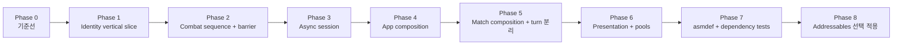

# PLAN 018 — 아키텍처 마이그레이션 실행 계획

> 상태: Phase 7 Complete — Phase 1~7 적용 완료, Phase 8 조건부 대기  
> 작성 기준: 2026-08-19 현재 코드, `AI_TARGET_ARCHITECTURE.md`, `ARCHITECTURE_EVOLUTION_KO.md`, MiniSurvival 참고 설계, Claude 원세션 검토안  
> 목적: 현재 동작을 보존하면서 식별자, 전투 결과 동기화, 세션 비동기, 수명, 관리 구조를 위험도 순서대로 개선한다.

## 1. 이 문서의 역할

이 문서는 실제 구현 순서와 단계별 완료 조건을 정의하는 canonical 실행 계획이다.

- `Docs/ARCHITECTURE_EVOLUTION_KO.md`: 현재/목표 구조와 선택 이유를 설명하는 사람용 설계서
- `Docs/AI_TARGET_ARCHITECTURE.md`: AI가 지켜야 하는 최종 구조 계약
- 이 문서: 어떤 순서로 무엇을 변경하고 어디서 멈춰 검증할지 정의하는 실행 계획
- `Docs/Plans/PLAN_019_four_player_expansion.md`: PLAN_018 완료 후 진행할 실제 4인 기능 계획

아직 아래 Phase의 런타임 코드는 적용되지 않았다. 각 Phase는 독립적으로 검증·커밋·되돌릴 수 있어야 하며, 이전 Phase의 검증을 통과하기 전 다음 Phase를 시작하지 않는다.

### 범위 경계

PLAN_018은 현재 1대1 gameplay를 보존하는 구조 마이그레이션이다. 새 Registry, coordinator, service API는 collection 기반으로 만들고 향후 2~4인 roster를 막지 않지만, 모든 런타임 완료 게이트는 `RequiredPlayerCount = 2`로 수행한다.

4인용 target selection, 전투 순서, 다중 사망, 승리 조건, disconnect/reconnect, UI 배치와 balance는 이 계획의 비목표다. 해당 기능은 `GAME_DESIGN.md` 결정을 선행한 뒤 PLAN_019에서 구현한다. 구조 이전과 player-count gameplay 변경을 같은 Phase에 섞지 않는다.

## 2. Claude 검토안에서 채택한 내용

다음 방향은 그대로 채택한다.

- ClientId와 논리 PlayerIndex 변환을 registry 한곳으로 제한한다.
- 서버가 Host 로컬 `CombatVFXManager.IsPlaying`을 읽는 구조를 제거한다.
- Lobby polling/heartbeat를 단일 소유 loop로 만들고 중복 실행을 차단한다.
- Lobby, Relay, NGO runtime, scene transition 경계를 분리한다.
- UI는 세션을 직접 오케스트레이션하지 않고 세션 상태를 관찰한다.
- App/Session/Match/Presentation 수명 범위를 명시한다.
- `TurnManager`는 유일한 권위 phase driver로 유지하면서 규칙과 표현 책임을 추출한다.
- Presentation 분리, pooling, asmdef, Addressables는 안정화 이후 단계적으로 진행한다.

### 2.1 채택한 패턴과 코드 매핑

| 문제 | 선택 패턴 | 코드 매핑 | 선택 이유 |
|---|---|---|---|
| 위험한 전면 교체 | Strangler Fig + vertical slice | Phase 1 identity, Phase 2 barrier, Phase 3 session 순서 | 구/신 authoritative owner의 동시 실행 없이 기능 단위 cutover 가능 |
| 수명과 생성 순서 | Composition Root | AppBootstrapper, MatchCompositionRoot | App/Match 생성·연결·폐기 책임 명시 |
| player identity 조회 | Registry | PlayerRegistry + read-only interface | polling과 ID cast 제거, spawn/despawn 수명 반영 |
| session 진행 | State Machine | SessionState + SessionOperation | UI 중복 명령과 부분 실패 전이를 한 owner가 제어 |
| UGS/NGO 의존 | Adapter / Anti-Corruption Layer | gateway, INetworkRuntime, network DTO mapper | 외부 모델·예외·직렬화가 Domain으로 누출되지 않음 |
| UI 진입점 | Facade | NetworkSessionCoordinator public commands | UI가 Lobby/Relay/NGO 순서를 조립하지 않음 |
| local notification | scoped Observer | App/Match ILocalEventHub 또는 직접 event | static event의 scene lifetime 누수 방지 |
| presentation 완료 | Barrier | PresentationBarrier | N개의 비동기 완료와 timeout/disconnect를 한 계약으로 결합 |
| 전투/환경 variation | Strategy/Policy | CombatEngine, EnvironmentRuleService | mode별 규칙을 phase driver에서 분리 |
| item effect mutation | Functional Core / Imperative Shell + Strategy | pure CombatContext/ItemEffect outcome → coordinator apply | SO/NGO 직접 mutation을 끊으면서 7개 category를 점진 이전 |
| 반복 presentation | Object Pool | Unity ObjectPool<T> | measured high-churn object만 reset 계약으로 재사용 |

Service Locator, global EventBus, 전면 DI framework, 모든 coroutine의 Awaitable 전환은 선택하지 않는다. 현재 규모에서 숨은 의존성과 migration surface를 늘리기 때문이다.

### 2.2 API와 package audit gate

각 Phase 계획 시작 시 `manifest.json`, `packages-lock.json`, exact installed package source와 공식 문서를 다시 확인한다. 2026-08-19 기준 baseline은 Unity `6000.3.11f1`, NGO `2.11.2`, Transport `2.7.2`, Lobby `1.3.0`, Relay `1.0.5`다.

- 신규 NGO RPC는 universal `[Rpc(...)]`를 우선한다. legacy ClientRpc/ServerRpc를 단지 최신화 목적으로 일괄 변경하지 않는다.
- Unity frame/scene/lifecycle에는 필요할 때 `Awaitable`, UGS I/O 경계에는 SDK가 반환하는 `Task`, 기존 interruptible VFX에는 Coroutine을 유지한다.
- package에 직접 CancellationToken 지원이 없으면 token 전달을 가장하지 않고 `OperationGeneration`으로 stale state commit을 막는다.
- 신규 API나 더 최신 compatible package가 발견되면 plan에 후보, 이점, breaking change, rollback, Host/Client test 영향을 기록한다.
- package version 변경은 이 migration에 부수적으로 포함하지 않는다. 사용자 승인과 별도 검증 gate가 필요하다.

## 3. 그대로 적용하지 않는 내용

### 3.1 `PlayerHandle`에 Unity 객체를 넣지 않는다

Claude 예시의 `PlayerHandle`은 `PlayerState`와 `PlayerInventory`를 값 타입 안에 보관한다. 이 방식은 다음 문제가 있다.

- Foundation/Common 타입이 구체적인 Unity 컴포넌트에 의존한다.
- despawn 이후 값 타입에 파괴된 Unity 객체 참조가 남을 수 있다.
- 순수 identity와 현재 runtime binding의 수명이 섞인다.

최종 계약은 identity와 binding을 분리한다.

```csharp
public readonly struct PlayerIdentity
{
    public byte PlayerIndex { get; }
    public ulong ClientId { get; }
}

public sealed class PlayerBinding
{
    public PlayerIdentity Identity { get; }
    public PlayerState State { get; }
    public PlayerInventory Inventory { get; }
    public NetworkObject NetworkObject { get; }
}
```

`PlayerIdentity`는 비교와 로그에 사용하는 순수 값이고, `PlayerBinding`은 Match 수명 안에서만 유효한 Unity 객체 묶음이다.

### 3.2 `Result<T>`를 모든 내부 메서드에 강제하지 않는다

`Result`는 외부 실패가 정상적으로 발생할 수 있는 경계에서 사용한다.

- Unity Services 초기화
- Lobby CRUD
- Relay allocation/join
- NGO start/stop 결과
- scene transition 요청

순수 전투 계산이나 프로그래밍 오류까지 `Result`로 감싸지 않는다. 문자열 하나만 반환하지 않고 최소한 `ErrorCode`, 사용자 표시 메시지, retry 가능 여부를 구분한다.

### 3.3 설치된 Lobby/Relay SDK 호출은 직접 취소할 수 없음을 전제로 한다

현재 설치 버전은 Lobby `1.3.0`, Relay `1.0.5`이며 공개 SDK 메서드에 `CancellationToken` 인자가 없다. 따라서 아래 두 가지를 구분한다.

- `Task.Delay`와 자체 loop: 토큰으로 즉시 취소
- 이미 시작한 Lobby/Relay 요청: 완료 자체는 기다리되, `OperationGeneration`이 바뀌었으면 결과를 상태에 반영하지 않음

토큰을 전달했다고 네트워크 요청까지 중단된다고 가정하지 않는다.

### 3.4 전투 `resultId`는 `byte`가 아니라 `uint`를 사용한다

`byte`는 256회 후 재사용되어 지연 ACK와 충돌할 수 있다. 매치 범위에서 증가하는 `uint ResultSequence`를 사용한다. 1회 전투 결과 RPC에 4바이트가 추가되는 비용보다 잘못된 ACK가 다음 전투를 해제하지 않는 것이 중요하다.

### 3.5 PresentationBarrier는 broadcast 전에 연다

다음 순서는 ACK race가 발생한다.

```text
잘못된 순서: result RPC broadcast -> barrier begin
```

빠른 클라이언트가 barrier 등록 전 ACK를 보내면 정상 ACK가 무시된다. 반드시 아래 순서를 사용한다.

```text
resultSequence 발급
-> required participant snapshot 생성
-> barrier Begin(resultSequence, participants)
-> result RPC broadcast
-> ACK 또는 timeout 대기
-> barrier 종료
```

### 3.6 `OnClientConnected`만으로 PlayerBinding을 등록하지 않는다

연결 callback 시점에는 Player prefab과 `PlayerState`가 아직 생성되지 않았을 수 있다.

- 서버: `SpawnAsPlayerObject` 완료 후 등록 후보 생성
- 모든 peer: `PlayerState.OnNetworkSpawn` 이후 runtime binding 가능
- 논리 인덱스: 서버가 두 player binding을 확인한 뒤 현재 정책인 ClientId 오름차순으로 확정
- despawn/disconnect: idempotent unregister

### 3.7 자체 `SimplePool<T>`부터 만들지 않는다

Unity 6의 `UnityEngine.Pool.ObjectPool<T>`/`IObjectPool<T>`를 우선 사용한다. 커스텀 풀은 NGO spawn pool처럼 Unity 기본 풀이 해결하지 못하는 수명 계약이 확인될 때만 도입한다.

### 3.8 파일 크기만 보고 클래스를 분리하지 않는다

`AZGameUI`를 정확히 5개, `CombatVFXManager`를 정확히 4개로 나누는 것이 목표가 아니다. 변경 이유, 수명, 입력과 출력, 테스트 경계가 독립적인 책임만 추출한다.

## 4. 변경하지 않을 핵심 불변식

1. `TurnManager` 계열의 단 하나의 서버 권위 phase driver만 존재한다.
2. `NetworkVariable`/`NetworkList`는 서버 권위 경로에서만 쓴다.
3. UI/VFX/Audio는 권위 상태를 직접 변경하지 않는다.
4. `NetworkManager.PlayerPrefab == null`과 `PlayerSpawnManager`의 서버 spawn 소유권을 유지한다.
5. 논리 PlayerIndex 정책은 현재 동작과 동일하게 연결된 두 플레이어의 ClientId 오름차순으로 시작한다.
6. Item ScriptableObject는 runtime read-only다.
7. 각 Phase에서 Host와 remote Client가 함께 실행 가능해야 한다.
8. Scene/prefab 변경은 Unity Editor 또는 검증된 Unity 자동화 경로로 수행한다.
9. pending item/target/sub-action 같은 비공개 turn intent는 서버 전용으로 유지한다.
10. 새 public API는 player collection을 사용하되 PLAN_018에서 실제 resolve 대상은 두 명이다.

## 5. 최종 실행 순서



`Result<T>`와 `SessionState`는 identity 기반 타입이 아니므로 Phase 1에서 미리 만들지 않고 실제 소비자인 Phase 3에서 도입한다. 사용되지 않는 foundation 타입을 먼저 쌓지 않는다.

## 6. Phase 0 — Characterization과 안전망

### 목표

구조 변경 전 현재 행동을 고정하고, 이후 회귀 여부를 비교할 자료를 만든다.

### 산출물

- Host 생성 → remote Client 참가 → GameScene 진입 smoke checklist
- 첫 턴 Prep/Attack/Resolution 로그
- 2라운드 reset과 매치 종료 로그
- lobby leave, host disconnect, client disconnect 시나리오
- ClientId/OwnerClientId/PlayerIndex를 한 줄에서 비교하는 임시 진단 로그 형식
- `_p1`/`_p2`, `PlayerModifiers[2]`, `PlayerState.BuildContext()`의 TurnManager singleton 접근, 단일 `_opponent*` presenter, P1/P2 result field를 pair-debt baseline으로 기록
- `ItemContext`와 7개 `ItemDataSO.ExecuteEffect` 구현이 읽고 쓰는 PlayerState/NV/NetworkList mutation inventory
- `CombatResolver.DetermineOrder`의 HeatWave 우선 규칙과 fallback, ready timestamp 양방향 비교, temperature 양방향 비교, 완전 동률 시 P0 우선 결과를 각각 고정하는 characterization cases
- `CombatResultData`의 EventCount cap (`Math.Min(Events.Count, 2)`)과 Event0/Event1 고정 슬롯 구조를 기록한다. 현재 `CombatResolver`에는 player별 main action을 추가하는 `Events.Add`가 두 곳뿐이므로 1대1 결과는 0..2개임을 정적 기준선으로 고정하고, 대표 0/1/2-event 결과가 wire 변환 후 동일한지 검증한다. 이후 producer가 3개 이상을 만들게 되면 조용히 truncate하지 말고 schema 변경 또는 명시적 실패를 요구한다.
- `ActionQueue.QueuedAction.ItemData`가 `ItemDataSO` ScriptableObject 참조를 직접 보관하는 현재 구조를 기록한다. Phase 5 cutover 동안에는 server-only compatibility queue로 허용하되, application/adapter 경계가 ItemId와 immutable `ItemEffectSpec`으로 변환한 뒤 pure Domain command에는 SO 참조나 catalog lookup이 남지 않게 한다.
- Unity Profiler 기준선: GC Alloc, `FindObjectsByType`, Instantiate/Destroy, UI rebuild
- 현재 Host-local VFX wait의 실제 Host/Client 완료 시각 기록

### 변경 범위

- 테스트 문서와 필요한 최소 진단 로그만 추가
- gameplay 동작 변경 금지

### 완료 게이트

- Host와 remote Client가 한 매치를 시작할 수 있다.
- 양쪽 player mapping과 전투 result 수신 순서를 비교할 수 있다.
- 현재 알려진 실패와 새 회귀를 구분할 기록이 있다.

## 7. Phase 1 — Player Identity vertical slice

### 목표

ClientId, OwnerClientId, PlayerIndex, 배열 위치의 암묵적 변환을 제거한다. 타입만 추가하고 끝내지 않고 실제 spawn → registry → Turn/VFX consumer 한 경로를 완성한다.

### 신규 계약 후보

```text
Assets/Scripts/Core/Player/Identity/PlayerIdentity.cs
Assets/Scripts/Core/Player/Identity/PlayerBinding.cs
Assets/Scripts/Core/Player/Identity/IReadOnlyPlayerRegistry.cs
Assets/Scripts/Core/Player/Identity/PlayerRegistry.cs
Assets/Scripts/Core/Match/MatchCompositionRoot.cs
```

`Common`에는 Unity 컴포넌트를 참조하는 `PlayerBinding`을 두지 않는다. asmdef 도입 전에도 향후 dependency 방향을 깨지 않는 위치를 사용한다.

### Phase 1 최소 MatchCompositionRoot

- GameScene의 `MatchCompositionRoot.Awake`가 Registry를 생성하고 `OnDestroy`가 구독과 Registry를 정리한다.
- 이 Root는 Phase 1에서 Registry owner와 Match lifetime만 담당한다. 환경·라운드·Presenter 조립은 아직 흡수하지 않는다.
- `TurnManager`와 `CombatVFXManager`에는 Root가 같은 read-only Registry 인스턴스를 명시적으로 bind한다.
- network prefab인 `PlayerState`는 scene reference를 serialize할 수 없으므로 `OnNetworkSpawn`에서 scene-local Root의 제한된 registration endpoint를 한 번 확인한다. 일반 gameplay service locator로 사용하거나 매 프레임 탐색하지 않는다.
- Root가 player spawn보다 먼저 준비된다는 GameScene 순서를 검증한다. 순서가 깨지면 조용히 polling하지 말고 진단 오류로 처리한다.
- Phase 5에서는 이 인스턴스를 교체하지 않고 같은 Root의 composition 책임만 확장한다.

### Registry 계약

```csharp
public interface IReadOnlyPlayerRegistry
{
    IReadOnlyCollection<PlayerBinding> Players { get; }
    int ReadyCount { get; }
    bool TryGetByPlayerIndex(byte index, out PlayerBinding player);
    bool TryGetByClientId(ulong clientId, out PlayerBinding player);
    event Action<PlayerBinding> Registered;
    event Action<PlayerIdentity> Unregistered;
}
```

- 일반 consumer에는 읽기 계약만 전달한다.
- `Register`, `AssignIndex`, `Unregister`, `Clear`는 concrete registry 또는 별도 writer 경계에 둔다.
- 중복 등록과 중복 해제는 안전해야 한다.
- 파괴된 Unity 객체가 조회되면 성공으로 반환하지 않는다.
- `Players`와 `Registered`는 유효한 PlayerIndex가 확정된 ready binding만 노출한다. spawn 직후 `SyncedPlayerIndex == -1`인 binding은 ClientId 기반 pending map에만 둔다.
- 각 peer는 `PlayerState.OnNetworkSpawn`에서 현재 `SyncedPlayerIndex` snapshot을 먼저 확인한다. 아직 `-1`이면 `OnValueChanged`를 구독하고, PLAN_018의 유효 범위인 0/1이 복제되는 순간 ready binding으로 한 번만 승격한다. Registry 계약과 iteration은 향후 0..3을 수용하지만 이 Phase에서 4인 index를 발급하지 않는다.
- `OnNetworkDespawn`은 index 구독부터 해제한 뒤 cached `PlayerIdentity`로 unregister한다. 파괴 중인 NetworkVariable에서 identity를 다시 계산하지 않는다.

### 전환 sub-gate

| Gate | 범위 | 완료 결과 |
|---|---|---|
| 1A | 최소 MCR + 빈 Registry | GameScene Root가 Registry 생성·폐기, consumer 없음 |
| 1B | PlayerState registration | spawn/despawn, pending→ready, Registered/Unregistered 완성 |
| 1C | lookup migration | Turn/VFX/spawn consumer와 `PlayerState.BuildContext()`의 opponent 조회가 Registry 사용 |
| 1D | polling cutover | `FindObjectsByType` polling 제거, `_p1`/`_p2`는 Registry projection bridge로 유지 |

적용 순서는 다음과 같다.

1. 현재 TurnManager의 ClientId 오름차순 인덱스 배정 규칙을 characterization test로 고정한다.
2. Gate 1A에서 최소 `MatchCompositionRoot`를 GameScene에 추가하고 Registry 생성·폐기 및 consumer binding을 확정한다.
3. Gate 1B에서 현재 존재하지 않는 `PlayerState.OnNetworkSpawn`/`OnNetworkDespawn` override를 새로 추가하고, 모든 peer에서 사용할 idempotent pending 등록/해제 경로를 만든다. 서버의 spawn 직후 등록은 동일 registry 연산을 사용한다.
4. 서버가 ClientId 기반 pending binding 두 개를 확인하면 PlayerIndex 0/1을 한 번 확정하고 `SyncedPlayerIndex`에 기록한다. 이 server assignment 경로는 기존 `PlayerState.Initialize(index, inventory)`의 index 설정과 inventory binding을 정확히 한 번 보존한다. Registry의 `Registered` observer나 `_p1`/`_p2` projection은 `Initialize`를 다시 호출하지 않는다. 각 peer는 유효한 index를 관찰한 뒤에만 ready `Registered` 이벤트를 발행한다.
5. Gate 1C에서 `CombatVFXManager`와 다른 identity consumer의 `(int)LocalClientId`, connected-client 순회 변환을 Registry 조회로 교체한다. `PlayerState.BuildContext()`의 `myIndex == 0 ? GetPlayer(1) : GetPlayer(0)`도 Registry 조회로 바꾸되, Temp/Buff/DropTable 같은 나머지 TurnManager service 접근은 Phase 5에서 제거할 명시적 compatibility bridge로 추적한다.
6. Gate 1D에서 TurnManager의 `FindObjectsByType<PlayerState>` 폴링을 Registry snapshot + `Registered`/`Unregistered` 이벤트로 교체한다. `_p1`/`_p2`는 이 Phase에서 제거하지 않고 Registry 결과를 반영하는 read-only projection으로 유지한다. 초기 snapshot, pending→ready, unregister를 모두 반영하며 Phase 5D에서 최종 제거한다.
7. disconnect/despawn/scene exit에서 registry를 정리한다. `PlayerState.OnNetworkDespawn`을 peer 공통 primary unregister hook으로 사용한다. 서버 `OnClientDisconnectCallback`은 pending spawn을 제거하고 despawn을 유발한 뒤, NetworkObject가 이미 없었던 경우에만 ClientId 기반 fallback unregister를 호출한다. 두 경로가 겹쳐도 결과가 같은 idempotent 연산이어야 한다.
8. 기존 scene/player discovery가 정상 match flow에서 0개인지 `rg`로 확인한다. Phase 5까지 허용된 `_p1`/`_p2` projection은 별도로 추적한다.

### 영향 파일

- `Core/Network/PlayerSpawnManager.cs`
- `Core/Match/MatchCompositionRoot.cs`
- `Core/Player/PlayerState.cs`
- `Core/Turn/TurnManager.cs`
- `Core/Combat/CombatVFXManager.cs`
- 필요 시 `InventoryPresenter.cs`, `AZPlayerVisual.cs`

### 완료 게이트

- Host가 ClientId 0이라는 가정 없이 양쪽 player를 찾는다.
- VFX의 local/opponent 판정이 registry를 통한다.
- P1/P2 모두 동일한 방식으로 동작한다.
- disconnect 후 stale `PlayerBinding`이 남지 않는다.
- 두 번째 라운드에서 mapping이 임의로 뒤집히지 않는다.
- GameScene마다 Root와 Registry가 정확히 하나이고 scene exit에서 폐기된다.
- `_p1`/`_p2`를 직접 할당하거나 별도 identity owner로 사용하는 경로가 없고, Registry projection만 남는다.

## 8. Phase 2 — Combat result sequence와 PresentationBarrier

### 목표

서버 진행을 Host 로컬 VFX singleton에서 분리하고, 각 전투 결과와 완료 ACK를 정확히 대응시킨다.

### 데이터 변경

- `CombatResult`와 `CombatResultData`에 `uint ResultSequence` 추가
- `ToNetData()`와 `NetworkSerialize()`에 같은 순서로 직렬화 추가
- 서버 Match 시작 시 0으로 초기화하고 combat resolve마다 증가
- 로그 형식에 `resultSequence` 포함
- 라운드 전환에서는 초기화하지 않는다. 향후 같은 GameScene/NetworkObject를 유지한 rematch를 지원하면 `MatchEpoch + ResultSequence`로 이전 매치의 지연 ACK를 구분한다.

### Barrier 책임

```text
Begin(sequence, expectedPresentationClientIds)
ReceiveAck(sequence, senderClientId)
WaitUntilCompleteOrTimeout(sequence, token)
HandleDisconnect(clientId)
Cancel(reason)
```

규칙:

- required set은 `Begin` 시점에 전투 결과를 표현해야 하는 활성 match participant의 ClientId snapshot만 포함한다.
- spectator/late join은 현재 결과의 required set에 자동 추가하지 않는다.
- barrier를 먼저 열고 result RPC를 보낸다.
- ACK는 RPC sender ID로 검증하며 payload의 client ID를 신뢰하지 않는다.
- 중복, 이전, 미래 sequence ACK는 무시하고 진단 로그만 남긴다.
- disconnect는 해당 client를 required set에서 제거한다.
- `Begin` 이후 새로 연결된 client는 진행 중 barrier에 추가하지 않는다.
- VFX presenter가 없거나 결과를 표현할 수 없는 클라이언트는 DTO를 정상 수신한 후 즉시 ACK한다.
- timeout은 presentation 장애가 authoritative match를 영구 정지시키지 않게 하는 복구 경계다.
- ACK는 전투 계산 결과를 바꾸지 않고 Resolution 진입 시점만 조율한다.

### Timeout 설정

- 초기 기본값은 현재 TurnManager의 기존 fallback과 같은 10초다.
- 첫 구현에서는 authoritative `PresentationBarrier` 또는 그 owner의 `[SerializeField, Min(1f)] float presentationTimeoutSeconds = 10f`로 둔다.
- gameplay 진행에 영향을 주므로 각 client의 로컬 설정을 사용하지 않고 서버 값 하나만 사용한다.
- 대기는 `Time.timeScale`에 영향받지 않는 unscaled/server elapsed time으로 계산한다.
- 여러 match timing 값을 함께 조정할 필요가 생길 때만 read-only `MatchTimingConfigSO`로 승격한다. 초기 단계에서 timeout 하나를 위해 새 SO를 만들지 않는다.

### 현재 Coroutine과의 연결

Combat VFX Coroutine은 유지한다. `CombatVFXManager`는 sequence를 보관하고 연출 종료의 단일 `finally` 경로에서 ACK를 요청한다. 중단, 예외, object destroy에서도 ACK/취소 정책이 한 번만 실행되게 한다.

TurnManager는 처음부터 전면 `Awaitable`로 바꾸지 않는다. 첫 구현은 기존 coroutine phase loop와 호환되는 adapter를 사용하고, barrier 자체의 상태/timeout은 서버 한곳에서만 관리한다.

### 전환 sub-gate

| Gate | 범위 | 완료 결과 |
|---|---|---|
| 2A | ResultSequence | DTO와 serializer 끝에 `uint ResultSequence` 추가 |
| 2B | ACK conversion | 모든 VFX exit가 하나의 idempotent complete 경로 사용 |
| 2C | Barrier activation | sender 검증 ACK, disconnect, timeout 연결 |
| 2D | old wait removal | Host-local `IsPlaying` loop 제거 |

2A~2D는 추적 가능한 개별 커밋으로 나눌 수 있다. 그러나 old/new 경로가 같은 전투 진행을 동시에 소유해서는 안 되며, Phase 2 전체 gate를 통과하기 전에는 완료된 런타임 경로로 병합하거나 배포하지 않는다.

### 완료 게이트

- `CombatVFXManager.Instance.IsPlaying`을 TurnManager가 읽지 않는다.
- Host와 remote Client ACK가 같은 sequence에 매칭된다.
- ACK 중복, 늦은 ACK, client disconnect, VFX object 부재, timeout을 검증한다.
- timeout 후 다음 전투의 ACK가 이전 barrier를 완료시키지 않는다.
- 실제 전투 계산과 온도/인벤토리 결과는 변경되지 않는다.

## 9. Phase 3 — Async Session과 NetworkSessionCoordinator

### 목표

Lobby/Relay/NGO/scene 작업을 한 상태 머신에서 직렬화하고 부분 실패를 보상한다.

### 3A. 현재 구조 즉시 안정화

- polling/heartbeat에 in-flight guard 추가
- mutable `currentLobby`를 await 전후로 재검증
- `async void` manager 메서드를 `Task`로 변경
- Unity lifecycle/UI entry만 얇은 `async void`로 유지하고 예외를 관찰
- 새 session operation과 leave/disconnect 때 `OperationGeneration` 증가

### 3B. Boundary adapter와 Result

```text
IUnityServicesGateway / UnityServicesGateway
ILobbyGateway / LobbyGateway
IRelayGateway / RelayGateway
INetworkRuntime / NgoNetworkRuntime
ISceneTransitionService / SceneTransitionService
```

`Result<T>`는 이 경계에서 도입한다.

```csharp
public enum OperationErrorCode
{
    None,
    Cancelled,
    InvalidState,
    AuthenticationFailed,
    LobbyNotFound,
    LobbyConflict,
    RelayFailed,
    NetworkStartFailed,
    Timeout,
    Unexpected
}
```

- Gateway는 SDK 예외를 구조화된 오류로 변환한다.
- 예상하지 못한 프로그래밍 오류를 성공/실패 값으로 숨기지 않는다.
- 사용자 메시지와 진단 세부 정보를 분리한다.

### 3C. SDK 취소 adapter

현재 Lobby/Relay public SDK는 token을 받지 않으므로 다음 패턴을 사용한다.

```text
operationGeneration 캡처
-> SDK Task await
-> session token 취소 여부 확인
-> generation이 현재와 같은지 확인
-> 같을 때만 current state commit
```

취소된 요청이 나중에 성공하면 필요한 보상 작업을 수행하되, 새 세션 상태를 덮어쓰지 않는다.

### 3D. Session state machine

공개 top-level `SessionState`:

```text
Offline
-> Initializing
-> Ready
-> Connecting
-> LoadingGame
-> InGame
-> Disconnecting
-> Ready 또는 Failed
```

`Connecting` 또는 `LoadingGame` 중 세부 `SessionOperation`:

```text
None
CreatingLobby
JoiningLobby
WaitingRelayCode
AllocatingRelay
JoiningRelay
StartingHost
StartingClient
WaitingForPlayers
```

`Connecting`에서는 `CreatingLobby`, `JoiningLobby`, `WaitingRelayCode`, `AllocatingRelay`, `JoiningRelay`, `StartingHost`, `StartingClient`를 사용한다. `LoadingGame`은 GameScene과 최소 `MatchCompositionRoot`가 준비된 뒤 `WaitingForPlayers`를 사용하며, required Registry binding이 완료되어야 `InGame`으로 전이한다. 활성 세부 작업이 없으면 `None`이다.

Host와 Client의 세부 진행 차이는 하나의 거대한 state enum이 아니라 공통 top-level `SessionState`와 `SessionOperation`으로 분리한다. `WaitingRelayCode`는 Client가 lobby snapshot에서 Relay code publication을 기다리는 명시적 operation이다.

### 보상 규칙

| 완료된 단계 | 다음 단계 실패 시 보상 |
|---|---|
| Lobby 생성 | 생성한 Lobby leave/delete 시도 |
| Relay allocation | Lobby에서 relay code를 게시하지 않고 allocation 폐기 |
| NGO start | `NetworkManager.Shutdown()` 후 Lobby 정리 |
| scene load 요청 | 중복 로드 차단, 실패 상태 노출, 안전한 Lobby 복귀 |

Cleanup 결과 규칙:

- Lobby leave/delete 같은 원격 cleanup 실패는 warning으로 남기고 로컬 NGO shutdown, token 취소, snapshot 제거를 끝낸 뒤 `Ready`로 복귀한다.
- 로컬 불변식을 복구하지 못했을 때만 `Failed`로 전이한다.
- `Failed -> Disconnecting`은 사용자가 cleanup 재시도를 명시적으로 요청했을 때만 실행하며 자동 반복하지 않는다.

### UI 변경

- `AZLobbyUI`는 `HostGameAsync`, `JoinGameAsync`, `LeaveAsync`, `RetryInitializeAsync`만 호출한다.
- 버튼 활성화, progress, 오류 표시는 coordinator state에서 파생한다.
- UI가 LobbyManager → RelayManager → SessionManager 순서를 직접 호출하지 않는다.

### 완료 게이트

- heartbeat와 polling은 각각 동시에 하나만 실행된다.
- Lobby SDK 요청 완료 순서가 뒤집혀도 오래된 결과가 상태를 덮지 않는다.
- 각 상태에서 leave/disconnect가 가능하다.
- Host/Client 부분 실패 후 Ready 또는 명시적 Failed 상태로 수렴한다.
- 게임 시작 후 lobby maintenance 정책이 의도대로 중지/유지된다.

## 10. Phase 4 — App Composition과 lifetime

### 목표

초기화 순서, persistent owner, App/Session token을 한곳에서 관리한다.

### 안전한 전환 순서

1. `AppBootstrapper`가 기존 manager를 참조하고 중복/누락을 검증한다.
2. Unity Services와 coordinator 초기화 순서를 bootstrapper가 소유한다.
3. 기존 manager별 DDOL은 한 클래스씩 bootstrapper 소유 root 아래로 이전한다.
4. 모든 persistent manager가 이전된 뒤에만 개별 DDOL 코드를 제거한다.

처음부터 모든 manager를 하나의 거대한 `AppRoot` prefab으로 이동하지 않는다. `NetworkObject`, scene reference, singleton 초기화 순서가 영향을 받을 수 있기 때문이다.

### 수명

```text
Application.exitCancellationToken
-> App lifetime
   -> Session lifetime
      -> Match lifetime
         -> Turn/Presentation operation
```

- Editor의 domain reload disabled 설정에서도 static 상태가 정상 reset되어야 한다.
- LobbyScene 재진입이 App root를 중복 생성하지 않아야 한다.
- bootstrapper는 모든 gameplay 로직을 흡수하지 않고 조립과 초기화만 담당한다.

### 완료 게이트

- 초기화 완료 전 Lobby 입력이 활성화되지 않는다.
- LobbyScene 왕복 후 DDOL manager가 한 개씩만 존재한다.
- Session 종료가 session loop와 관련 presenter 작업을 취소한다.
- 기존 NetworkManager/PlayerSpawnManager 설정이 유지된다.

## 11. Phase 5 — Match Composition과 Turn 책임 분리

### 목표

GameScene 참조 검증과 binding을 한곳에 모으고, TurnManager의 권위 driver는 유지하면서 계산·reset·표현 발행 책임을 줄인다.

### Phase 5 composition prerequisite

- Phase 1부터 유지된 Match lifetime과 Registry ownership 보존
- scene 필수 참조 1회 검증으로 책임 확장
- server/client consumer composition 확장
- server-only service와 client presenter를 구분해 연결
- scene unload 시 구독, registry, pool, async operation 정리

`GameObject.Find`는 root의 검증 fallback에서 일시적으로 사용할 수 있으나, 정상 경로는 serialized reference 또는 명시적 registration이다.

이 prerequisite는 service ownership을 옮기지 않고 composition/binding만 확장한다. 완료 후 별도 sub-gate 5A를 시작한다.

### 5A. Class extraction only

- `EnvironmentRuleService`, `RoundLifecycleService`, `CombatEngine`의 순수 계산 경계를 먼저 추출한다.
- 기존 TurnManager가 같은 순서로 호출하고 authoritative write와 RPC 위치는 바꾸지 않는다.
- 이 단계의 목적은 코드 이동과 behavior/ownership 변경을 분리해 회귀 원인을 좁히는 것이다.
- Phase 0에서 기록한 `ItemContext -> CanUse/ExecuteEffect` mutation inventory와 각 item category의 two-player golden result를 고정한다.
- Reroll/Steal/DropTable처럼 `UnityEngine.Random`을 사용하는 경로는 선택 결과까지 characterization하고 test에서는 고정 sequence random을 주입할 수 있게 준비한다.

### 5B. Read responsibility

서비스 입력을 `_p1`/`_p2`나 `TurnManager.Instance`에서 읽지 않고 Registry collection과 명시적 context로 전달한다. 규칙 계산과 presentation staging을 한 클래스로 옮기지 않는다.

- `EnvironmentRuleService`: 어떤 authoritative 효과를 적용할지 결정
- network/presentation bridge: Kids/Ambulance 공지와 staging RPC 전달
- `PlayerModifiers[2]` literal은 match seat 수로 생성되는 seat-indexed runtime collection으로 바꾼다. PLAN_018에서는 길이가 2지만 API와 iteration은 literal pair를 소유하지 않는다.
- pure `CombatContext`와 item config snapshot을 도입하고, 현재 `ItemContext`는 category별 cutover 동안만 사용하는 compatibility adapter로 제한한다.
- ItemDataSO는 immutable authoring/catalog config로 유지하고 adapter가 필요한 값만 pure `ItemEffectSpec`으로 복사한다. Domain strategy는 ScriptableObject 참조를 보관하지 않는다.
- random item effect는 `IRandomSource`를 context로 받고, live adapter만 Unity random을 사용한다. Domain test는 seed/sequence를 고정한다.
- `PlayerState.BuildContext()`가 Registry, modifiers, temperature, buff, drop table을 직접 조립하지 않도록 Match composition/application layer가 필요한 context를 제공한다.
- `PlayerState`의 나머지 `TurnManager.Instance` 참조도 목록화한다. PlayerState는 RPC ingress/replicated state holder로 남고, phase/intent 검증은 명시적으로 bind된 `IPlayerIntentSink`/TurnFlowCoordinator에 위임하며 publication은 TurnNetworkBridge를 사용한다. 새 service locator 조회로 singleton을 감추지 않는다.

### 5C. Write responsibility

- player state reset
- initial inventory grant
- round score/next-round 준비
- 중복 호출에 대한 명시적 보호
- 서비스는 Domain result/state delta를 반환하고, 권위 NetworkVariable write는 현재 single coordinator/NetworkBehaviour가 적용한다.
- Item rule은 temperature delta, modifier change, scheduled effect, inventory mutation, presentation event 같은 typed outcome을 반환한다.
- coordinator/application layer만 outcome을 `PlayerState`, `PlayerInventory`, NetworkVariable/NetworkList에 적용한다.
- migration 순서는 attack/recovery/defense → buff/debuff → sabotage/special로 진행하고 category마다 기존 2인 결과와 inventory consumption을 비교한다.

| Gate | Item-effect cutover | 완료 증거 |
|---|---|---|
| 5C-1 | typed outcome와 authoritative apply shell | outcome 자체는 NV/NetworkList를 참조하지 않음 |
| 5C-2 | attack/recovery/defense | temperature, defense, consumption golden test |
| 5C-3 | buff/debuff | immediate/delayed effect와 schedule golden test |
| 5C-4 | sabotage/special | reroll/steal/block/reveal/fan과 fixed-random golden test |

각 5C sub-gate에서 해당 category의 old/new writer를 동시에 실행하지 않는다. 비교가 필요하면 old path 결과를 read-only characterization oracle로만 사용한다.

모든 mutation entry는 server-only다.

### 5D. Old ownership removal and network publication seam

RPC를 한 번에 별도 `NetworkBehaviour`로 이동하지 않는다. RPC 이동은 scene/prefab component wiring과 NGO 실행 위치를 바꾼다.

1. TurnManager 내부 RPC 앞에 의미 있는 publication 메서드를 만든다.
2. DTO와 호출 순서를 안정화한다.
3. 실제 독립 테스트/재사용 이득이 확인되면 같은 NetworkObject의 `TurnNetworkBridge` component로 이동한다.
4. 이동 후 authority, sender, ownership, late subscription을 다시 검증한다.
5. 모든 consumer가 collection/Registry 경로로 이전된 뒤 `_p1`/`_p2` projection과 pair bridge method를 제거한다.
6. static event emitter와 scoped event hub를 동시에 발행하지 않는다. 소비처 cutover 후 legacy emitter를 제거한다.
7. 모든 item category가 typed outcome 경로로 이전된 뒤 NGO-coupled `ItemContext` 직접 mutation과 compatibility adapter를 제거한다.
8. `MatchManager.P1RoundWins/P2RoundWins`는 PLAN_018에서 wire/storage를 즉시 바꾸지 않고 collection-shaped read model 뒤에 격리한다. `AZGameUI`는 그 read model을 사용한다. `CombatResult`/`CombatResultData`의 P1/P2와 Event0/Event1 wire 형태도 `TwoPlayerCombatResultMapper` 같은 명시적 compatibility mapper 뒤에 두며, 실제 roster-indexed score와 bounded result batch 전환은 PLAN_019에서 수행한다.

PLAN_018의 `CombatEngine` 입력은 collection 형태를 사용할 수 있지만 실제 participant 수는 두 명이며 결과는 현재 1대1 규칙과 같아야 한다. N-player target selection, 다중 사망, 승리 조건은 PLAN_019 범위다.

Phase 5 item-effect 영향 범위:

```text
Core/Item/Data/ItemContext.cs
Core/Item/Data/ItemDataSO.cs
Core/Item/Data/{Attack,Recovery,Defense,Buff,Debuff,Sabotage,Special}ItemDataSO.cs
Core/Combat/CombatResolver.cs
Core/Combat/TemperatureSystem.cs
Core/Buff/BuffDebuffSystem.cs
Core/Player/PlayerState.cs
Core/Player/PlayerInventory.cs
Core/Player/ActionQueue.cs
Core/Turn/TurnManager.cs
```

파일을 한 번에 바꾸라는 목록이 아니라 mutation inventory와 category별 cutover에서 반드시 추적해야 하는 surface다. `ActionQueue.QueuedAction.ItemData`는 cutover 중 server-only compatibility queue에만 허용한다. application/adapter가 `ItemDataSO`를 ItemId와 immutable `ItemEffectSpec`으로 변환하고, pure Domain command/strategy는 SO 참조와 catalog lookup을 모두 갖지 않는다. 모든 consumer가 새 경계로 이전된 뒤 compatibility queue의 SO 필드를 제거할지 판단한다.

Phase 5 pair/result compatibility 추적 범위:

```text
Core/Combat/CombatResult.cs
Core/Match/MatchManager.cs
UI/Game/AZGameUI.cs
```

이 세 파일의 기존 1대1 wire/storage는 PLAN_018에서 호환 mapper/read model 뒤에 격리한다. `CombatResultData`의 Event0/Event1 고정 슬롯과 `Math.Min(Events.Count, 2)` cap도 호환 mapper 범위에 포함한다. N-player schema와 roster-indexed score로 실제 교체하는 시점은 PLAN_019다.

### 완료 게이트

- phase state를 쓰는 driver는 하나다.
- Environment 규칙은 UI/VFX 타입을 참조하지 않는다.
- 7개 ItemDataSO category의 migrated rule은 PlayerState, NetworkVariable, NetworkList를 직접 변경하지 않는다.
- item category별 golden test에서 temperature, modifier, inventory consumption, scheduled effect 결과가 현재 1대1과 동일하다.
- round reset은 2라운드 이상 재사용 가능하다.
- TurnManager에서 반복 player discovery와 Host VFX singleton 참조가 없다.
- 모든 RPC 이동은 Host/remote Client에서 다시 검증된다.
- `_p1`/`_p2`, `1 - playerIndex`, P1/P2 전용 새 API가 authoritative match flow에 남지 않는다. 기존 wire DTO를 즉시 N-player schema로 바꾸지 않는 경우 명시적 compatibility mapper 뒤에 격리한다.
- `PlayerState.BuildContext()`와 다른 PlayerState intent/RPC 경로, item rule에서 `TurnManager.Instance`를 통한 dependency graph 조립이 남지 않는다.

## 12. Phase 6 — Presentation 분리와 Pooling

### 적용 순서

1. Profiler에서 실제 high-churn 대상을 다시 측정한다.
2. `EmoteBubble`과 반복 particle처럼 수명이 단순한 대상부터 Unity `ObjectPool<T>` 적용
3. get/release reset 계약과 event/coroutine cleanup 테스트
4. `ItemWorldView`는 slot identity/compaction 문제를 먼저 해결한 뒤 diff update + pool 적용
5. 큰 presenter는 입력, 출력, 수명이 독립적인 책임만 추출

### 우선 후보

- `EmoteBubble`
- hit/ice-break/final-break effects
- 반복 생성되는 mini-game helper
- `ItemWorldView`는 마지막 후보

### 금지

- Player NetworkObject를 일반 Unity pool로 관리
- release 시 event/Coroutine/target/Animator 상태를 남김
- 성능 측정 없이 모든 GameObject를 pool로 변경

### 완료 게이트

- 대상별 Instantiate/Destroy와 GC Alloc 감소가 측정된다.
- 두 번째 사용에서 이전 player/item/result 상태가 남지 않는다.
- Inventory rebuild lock과 slot compaction 동작이 보존된다.

## 13. Phase 7 — asmdef와 dependency tests

### 선행 조건

- Turn/domain 규칙에서 concrete presentation 참조 제거
- UI ↔ Core 순환 호출 축소
- cross-folder singleton 접근 감소
- target assembly dependency graph를 실제 namespace/reference scan으로 재검증

### 적용 원칙

- 폴더 이동, asmdef 추가, 기능 변경을 같은 변경에 섞지 않는다.
- `.meta`를 보존한다.
- asmdef 하나만 추가해 나머지 `Assembly-CSharp`가 역참조되는 상태를 만들지 않는다.
- Foundation → Domain/Networking → Application → Presentation 방향을 컴파일러가 강제한다.

### 완료 게이트

- Unity Editor compilation 성공
- Domain EditMode tests 성공
- Host/Client PlayMode smoke 성공
- 의도하지 않은 assembly reverse reference가 없다.

## 14. Phase 8 — Addressables 선택 적용

다음 조건을 모두 만족할 때만 시작한다.

- Resources 로드 또는 빌드 메모리가 실제 병목으로 측정됨
- typed visual/audio/resource catalog가 먼저 완성됨
- handle owner와 release 시점이 정의됨
- 로드 실패 fallback이 정의됨

첫 적용 대상은 큰 비네트워크 VFX, audio, environment asset이다. Player NetworkPrefab과 필수 Item registry는 첫 단계에서 제외한다.

## 15. Phase별 변경 단위

한 Phase도 하나의 거대한 변경으로 구현하지 않는다.

| Phase | 권장 세부 변경 단위 |
|---|---|
| 0 | checklist → 로그 → profiler baseline |
| 1 | contracts → registration → Turn lookup → VFX lookup → cleanup |
| 2 | sequence DTO → barrier server state → client ACK → Turn integration |
| 3 | overlap guard → generation → gateway → coordinator → UI facade |
| 4 | bootstrap validation → init order → lifetime → DDOL migration |
| 5 | root binding → environment rules → round lifecycle → publication seam |
| 6 | 측정 → 대상 하나 pool → 검증 → 다음 대상 |
| 7 | dependency scan → asmdef 한 계층 → compile → 다음 계층 |

각 세부 변경 뒤 Unity가 컴파일되고 기존 Host/Client 경로가 실행 가능해야 한다.

### 15.1 Phase 불변식

각 완료 gate는 적용 가능한 불변식을 확인한다.

| ID | 불변식 | 적용 시작 |
|---|---|---|
| INV-1 | PlayerIndex server writer는 정확히 하나다. | Phase 1 |
| INV-2 | PlayerInventory 초기화 경로는 정확히 하나다. | Phase 1 |
| INV-3 | 사용자 요청 하나당 session start command는 최대 한 번 실행된다. | Phase 3 |
| INV-4 | TurnPhase를 쓰는 authoritative driver는 정확히 하나다. | Phase 5 |
| INV-5 | ResultSequence는 Match 수명 동안 단조 증가하고 round에서 reset되지 않는다. | Phase 2 |
| INV-6 | 같은 ClientId는 ready Registry binding을 최대 하나만 가진다. | Phase 1 |
| INV-7 | Presentation ACK는 RPC sender ClientId와 ResultSequence로 검증한다. | Phase 2 |
| INV-8 | 각 peer의 loaded GameScene에는 MatchCompositionRoot가 정확히 하나다. | Phase 1 |
| INV-9 | Barrier pending은 Begin 시점 expected presentation participant의 부분집합이며 연결이 끊기면 제거되고 이후 연결은 추가되지 않는다. | Phase 2 |

### 15.2 생명주기 매트릭스

| 시나리오 | Root | Registry | PlayerBinding | Barrier | Session operation |
|---|---|---|---|---|---|
| LobbyScene에서 Host/Client 시작 | 없음 | 없음 | 없음 | 없음 | 현재 OperationGeneration |
| GameScene 로드 완료 | 각 peer에서 새로 하나 생성 | 빈 인스턴스 생성 | spawn 대기 | inactive | WaitingForPlayers 준비 |
| Player NetworkObject spawn | 유지 | pending 또는 ready 등록 | pending→ready | inactive | WaitingForPlayers |
| Client disconnect | 유지 | idempotent 제거 | 무효화 | pending에서 제거 | cancel/ignore 정책 |
| GameScene unload | 파괴 | clear + dispose | 전체 무효화 | terminate | generation 재검증 |
| GameScene 재진입 | 새로 생성 | 새 빈 인스턴스 | 재등록 | reset | 새 scene operation |
| 같은 GameScene의 두 번째 round | 유지 | 유지 | 유지 | 다음 sequence | 변화 없음 |

### 15.3 관측 키와 조기 탐지

비동기 stale completion을 무효화하는 필드와 로그 키는 `OperationGeneration`으로 통일한다. `SessionId`처럼 세션 동안 유지되는 식별자와 혼동하지 않는다.

공통 로그 키:

```text
OperationGeneration
MatchEpoch
RoundIndex
ResultSequence
ClientId
PlayerIndex
```

| 위험 | 조기 탐지 | 필수 대응 |
|---|---|---|
| PlayerIndex 이중 할당 | 같은 ClientId에 다른 index 로그 | 두 번째 writer 차단 |
| Session 이중 시작 | generation당 StartHost/StartClient 2회 | request gate로 거부 |
| ACK 누락 | timeout과 미응답 ClientId 출력 | disconnect 재검증 후 해당 barrier만 종료 |
| Root 중복 | 동일 peer/scene Root 2개 이상 | 후발 Root를 거부하고 오류 기록 |
| Event 이중 발행 | sequence당 handler 2회 | legacy emitter 비활성화 |
| client NV write | NGO authority 오류 | client write 경로 제거 |
| stale async completion | await 후 generation 불일치 | 결과 폐기 후 필요한 compensation만 수행 |

Editor의 Enter Play Mode Domain Reload 비활성화에서는 이전 Play 세션의 static event와 `Instance`가 잔존할 수 있다. `[RuntimeInitializeOnLoadMethod(RuntimeInitializeLoadType.SubsystemRegistration)]` reset은 Editor 반복 실행 안전망으로 사용할 수 있지만, 빌드 실행 중 Lobby↔Game scene 전환의 unsubscribe와 idempotent cleanup을 대신하지 않는다.

## 16. 공통 검증 매트릭스

| 시나리오 | 0 | 1 | 2 | 3 | 4 | 5+ |
|---|---:|---:|---:|---:|---:|---:|
| Host 생성 | ✅ | ✅ | ✅ | 필수 | 필수 | 필수 |
| remote Client 참가 | ✅ | 필수 | 필수 | 필수 | 필수 | 필수 |
| PlayerIndex mapping | 기록 | 필수 | 필수 | 필수 | 필수 | 필수 |
| 전투 1회 | ✅ | 필수 | 필수 | ✅ | ✅ | 필수 |
| ACK timeout/duplicate | — | — | 필수 | ✅ | ✅ | 필수 |
| Client disconnect | 기록 | 필수 | 필수 | 필수 | 필수 | 필수 |
| Lobby 부분 실패 | 기록 | — | — | 필수 | 필수 | 필수 |
| 2라운드 reset | 기록 | 필수 | 필수 | ✅ | ✅ | 필수 |
| LobbyScene 왕복 | 기록 | ✅ | ✅ | 필수 | 필수 | 필수 |

## 17. 구현 중단 조건

다음 상황에서는 다음 Phase로 넘어가지 않는다.

- 코드, `GAME_DESIGN.md`, item SO가 서로 다른 gameplay 결과를 요구함
- PlayerIndex 정책을 바꾸어야 함
- NGO scene/prefab component 변경이 필요한데 live Unity 검증 수단이 없음
- Host는 성공하지만 remote Client 경로가 검증되지 않음
- 새 구조와 기존 구조가 동시에 같은 phase/session을 구동함
- cancellation 이후 late result가 새 세션 상태를 덮음
- barrier timeout 이후 이전 ACK가 다음 결과에 영향을 줌

## 18. 최종 성공 조건

- 모든 player identity 변환이 registry를 통한다.
- 새 match API는 player collection을 사용하며 `_p1`/`_p2`, `1 - index`, ClientId-as-seat 가정을 만들지 않는다.
- migrated item rules는 pure config/context에서 typed outcome을 반환하고 authoritative coordinator만 NetworkVariable/NetworkList에 적용한다.
- 서버 진행이 Host 로컬 presentation 상태를 직접 읽지 않는다.
- Lobby/Relay/NGO/scene 흐름의 소유자가 `NetworkSessionCoordinator` 하나다.
- AppBootstrapper와 MatchCompositionRoot는 조립과 수명을 소유하되 gameplay god object가 아니다.
- TurnManager 계열의 phase driver는 하나만 유지된다.
- cancellation, disconnect, scene unload, round reset이 명시적으로 정리된다.
- pooling과 asmdef는 측정 및 dependency 정리 후 적용된다.
- 각 단계의 Host/remote Client 증거가 남아 있다.
- 비공개 action/item/target intent가 Everyone-readable NetworkVariable로 노출되지 않는다.
- PLAN_018 완료는 4인 gameplay 완료를 의미하지 않으며, 실제 4인 활성화는 PLAN_019 gate를 따른다.

## 19. 첫 구현 권고

바로 Phase 1 타입부터 추가하지 않는다. 첫 실제 작업은 Phase 0의 최소 Host/Client characterization과 identity 로그다. 그 증거가 확보되면 Phase 1을 다음 순서로 시작한다.

```text
PlayerIdentity/PlayerBinding 계약
-> 최소 MatchCompositionRoot + idempotent PlayerRegistry
-> spawn/despawn registration
-> TurnManager lookup 교체
-> CombatVFXManager local/opponent 판정 교체
-> Host/Client/round-reset/disconnect 검증
```

Phase 1 완료 전 `Result<T>`, `AppBootstrapper`, asmdef를 미리 추가하지 않는다.
